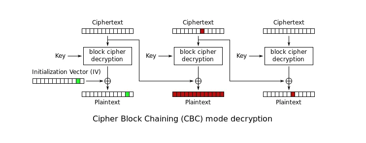
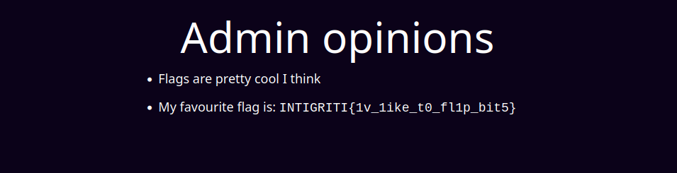

# Share It (part 1)

## Description

Check out my new cool platform for sharing your thoughts. I used my 1337 crypto skills to craft session tokens 🔐

Author: holmesec

https://shareit.ctf.intigriti.io || https://shareit2.ctf.intigriti.io

## Source code analysis

Challenge web application source code is provided together with the description; main application logic is defined inside the `app.py` file:

```python
from flask import Flask, render_template, request, redirect, url_for, make_response
from Crypto.Cipher import AES
from Crypto.Util.Padding import pad, unpad
import os
import json
import base64
from waitress import serve

app = Flask(__name__)

key = os.urandom(16)

FLAG = os.getenv("FLAG")
if not FLAG:
    FLAG = "FLAG{dummy}"


def gen_encrypted_cookie(username):
    iv = os.urandom(16)
    cipher = AES.new(key, AES.MODE_CBC, iv=iv)
    user_dict = {'admin': False, 'username': username}
    c = cipher.encrypt(pad(json.dumps(user_dict).encode(), 16))
    return base64.b64encode(json.dumps({'user_dict': base64.b64encode(c).decode(),
                                        'iv': base64.b64encode(iv).decode()}).encode()).decode()


def decrypt_cookie(cookie):
    cookie_dict = json.loads(base64.b64decode(cookie).decode())
    iv = base64.b64decode(cookie_dict['iv'].encode())
    cipher = AES.new(key, AES.MODE_CBC, iv=iv)
    dec_token = cipher.decrypt(base64.b64decode(cookie_dict['user_dict'].encode()))
    unpadded_token = unpad(dec_token, 16)
    user_dict = json.loads(unpadded_token)
    print(user_dict)
    return user_dict

@app.route("/")
def index():
    cookie = request.cookies.get("token")
    print(cookie)
    if cookie == None:
        return redirect(url_for('register'))
    else:
        try:
            user_dict = decrypt_cookie(cookie)
        except:
            return redirect(url_for('register'))
        return render_template('index.html', username=user_dict['username'])


@app.route("/register", methods=['GET', 'POST'])
def register():
    if request.method == "GET":
        return render_template("register.html")
    elif request.method == "POST":
        username = request.form["username"]
        if username == None or username == "":
            return "username must be set", 400
        cookie = gen_encrypted_cookie(username)
        res = make_response(redirect(url_for('index')))
        res.set_cookie('token', cookie)
        return res


@app.route("/admin-opinions")
def admin():
    cookie = request.cookies.get("token")
    print(cookie)
    if cookie == None:
        return redirect(url_for('register'))
    else:
        try:
            user_dict = decrypt_cookie(cookie)
            print(user_dict)
        except Exception as e:
            print(e)
            return redirect(url_for('register'))
        if not user_dict['admin'] == True:
            return "<p>Only admins are allowed to read these cool opionons</p>", 403
        else:
            return render_template("admin.html", flag=FLAG)


if __name__ == '__main__':
    print("Starting app...")
    app.run(debug=True, host='localhost', port=5000)
```

This is a basic web application allowing users to sign up and access to some mock functionalities; 
the most interesting part is of course the admin's reserved endpoint, which displays the flag.

```python
@app.route("/admin-opinions")
def admin():
    cookie = request.cookies.get("token")
    print(cookie)
    if cookie == None:
        return redirect(url_for('register'))
    else:
        try:
            user_dict = decrypt_cookie(cookie)
            print(user_dict)
        except Exception as e:
            print(e)
            return redirect(url_for('register'))
        if not user_dict['admin'] == True:
            return "<p>Only admins are allowed to read these cool opionons</p>", 403
        else:
            return render_template("admin.html", flag=FLAG)
```

As we can see, the server is displaying the flag only if:
```python
user_dict['admin'] == True
```

`user_dict` is created by the server during the signup process:

```python
user_dict = {'admin': False, 'username': username},
```

where `username` is the actual username chosen by the user during sign up, while `admin` is by default set to False (i.e. no admin account can be created).

```python
def gen_encrypted_cookie(username):
    iv = os.urandom(16)
    cipher = AES.new(key, AES.MODE_CBC, iv=iv)
    user_dict = {'admin': False, 'username': username}
    c = cipher.encrypt(pad(json.dumps(user_dict).encode(), 16))
    return base64.b64encode(json.dumps({'user_dict': base64.b64encode(c).decode(),
                                        'iv': base64.b64encode(iv).decode()}).encode()).decode()
```

`user_dict` is then encrypted with AES in CBC mode, the used `iv` is randomly generated. In the end, the encrypted dictionary and the `iv` are each separately base64 encoded and stored in a new dictionary:

```json
{
    'user_dict': "base64(user_dict)", 
    'iv': "base64(iv)" 
}
```

the whole dictionary is then base64 encoded and set into a client's cookie named `token`: everytime the `/admin-opinions` endpoint is invoked, the client must send this cookie to the server, which in particular decrypts the received `user_dict` and checks for the `admin` attribute value in order to authorize or deny the requested operation.

## Exploit

In order to be allowed to access `/admin-opinions` and obtain the flag it is necessary to inject a token with `admin` set to `True`; since the server is sending to the client the `iv`, it is possible to perform without particular complications a [cbc-mode bit-flipping attack](https://zhangzeyu2001.medium.com/attacking-cbc-mode-bit-flipping-7e0a1c185511).



According to CBC mode behavior, in order to recover the original plaintext block $P_i$, the corresponding ciphertext block $C_i$ must be first decrypted: the result is an intermediate block $P'_i$ which after being XORed with the previous ciphertext block $C_{i-1}$ results in the actual plaintext block $P_i$. 

In formulas:

$P'_i = Dec(K, C_i) \\
P_i = P'_i \oplus C_{i-1}$

If there is a leak about $P_i$, it is possible to modify $C_{i-1}$ by XORing it with a new byte sequence $x$ (obtaining a new ciphertext block $C'_{i-1}$) in order to force the decrypted data to be a new block $N_i$:

$C'_{i-1} = C_{i-1} \oplus x$

$N_i = Dec(K, C_i) \oplus C'_{i-1}$

$N_i = P'_{i} \oplus C_{i-1} \oplus x$

$N_i = P_i \oplus x$

But since $P_i$ is known, it is possible to craft $x$ in order to completely replace the final decrypted value with a new block $y$:

$x = P_i \oplus y$

$N_i = P_i \oplus x = P_i \oplus P_i \oplus y = y$

The main issue with this attack is that, in order to replace $P_i$ with $y$, the ciphertext block $C_{i-1}$ needs to be manipulated accordingly: as a direct consequence, $P_{i-1}$ will be corrupted and result in an unpredictable byte sequence when decrypted. 

In this case the attack will be successful because the iv is not an actual ciphertext block (=$C_0$) and its value is not checked by the server to be one initially sent to the client (meaning that the `iv` manipulation is not detected during decryption phase).

I wrote the following script to:

1. register a new user and retrieve its `token` (= encrypted `user_dict` and `iv`)
2. forge the new token, knowing the original `iv` and `user_dict` struct:
   
    ```python
    # original 
    {"admin": False, "username": "NOT_YET_ADMIN???"}
    # modified
    {"admin":  True, "username": "NOT_YET_ADMIN???"}
    ```
3. set a new `token` with the modified `iv`
4. invoke `/admin-opinions` and obtain the flag 

```python
import json
import base64
import requests

base_url = "https://shareit.ctf.intigriti.io"

# register a new user and get the corresponding token
def register_user(username):
    session = requests.Session()

    register_body = {
        "username": username
    }
    session.post(base_url + "/register", data=register_body)
    token = session.cookies["token"]
    print(f"original token: {token}")
    token = json.loads(base64.b64decode(token).decode())
    return token

# forge a new iv which forces b"false" -> b" true" and compute the new resulting token
def forge_token(token, user_dict_leak, server_iv):  
    new_admin_value = b" true"
    flipped_iv = bytearray(server_iv)
    index_to_flip = user_dict_leak.index(b"f")
    
    for flip in new_admin_value:
        mask = flip ^ user_dict_leak[index_to_flip]
        flipped_iv[index_to_flip] = flipped_iv[index_to_flip] ^ mask
        index_to_flip += 1

    token["iv"] = base64.b64encode(flipped_iv).decode()
    new_token = {"token": base64.b64encode(json.dumps(token).encode()).decode()}
    
    get_flag = requests.get(base_url + "/admin-opinions", cookies=new_token)
    
    if "flag" in get_flag.text:
        print(f"forged token: {new_token['token']}")
        print(f"forged iv: {base64.b64encode(flipped_iv).decode()}")
        print(get_flag.text)


if __name__ == "__main__":
    user_dict = {"admin": False, "username": "NOT_YET_ADMIN???"}
    user_dict_leak = json.dumps(user_dict).encode()
    token = register_user(user_dict["username"])
    
    server_iv = bytearray(base64.b64decode(token["iv"]))
    forge_token(token, user_dict_leak, server_iv)
```
result:

```html
original token: eyJ1c2VyX2RpY3QiOiAiemVnWm9IRm8rNmp2RWRDMzRyS0E4aUZUWlBBN2p5RGIxc2NETjFjZXVvMFJuM1Y0WWE5S1dXRDVGdEczeGswS2dNUFhVYllzKzBTNjhDSXRvbWdudkE9PSIsICJpdiI6ICJUYjAxYjdwbS9DdlYxYmRLRWlxNTNnPT0ifQ==
forged token: eyJ1c2VyX2RpY3QiOiAiemVnWm9IRm8rNmp2RWRDMzRyS0E4aUZUWlBBN2p5RGIxc2NETjFjZXVvMFJuM1Y0WWE5S1dXRDVGdEczeGswS2dNUFhVYllzKzBTNjhDSXRvbWdudkE9PSIsICJpdiI6ICJUYjAxYjdwbS9DdlYxZkZmREN5NTNnPT0ifQ==
forged iv: Tb01b7pm/CvV1fFfDCy53g==
<!DOCTYPE html>
<html lang="en">
  <head>
    <meta charset="UTF-8" />
    <meta http-equiv="X-UA-Compatible" content="IE=edge" />
    <meta name="viewport" content="width=device-width, initial-scale=1.0" />
    <link rel="stylesheet" href="/static/style.css" />
    <title>Admin - ShareIt</title>
  </head>
  <body class="bg-primary">
    <div class="container mx-auto max-w-3xl p-6 text-white">
      
<div class="max-w-max mx-auto">
  <h1 class="text-6xl mb-4 text-center">Admin opinions</h1>
  <ul class="list-disc">
    <li class="text-lg mb-3">Flags are pretty cool I think</li>
    <li class="text-lg mb-3">My favourite flag is: <code>INTIGRITI{1v_1ike_t0_fl1p_bit5}</code></li>
  </ul>
</div>

    </div>
  </body>
</html>
```

rendered page:



flag:

    INTIGRITI{1v_1ike_t0_fl1p_bit5}