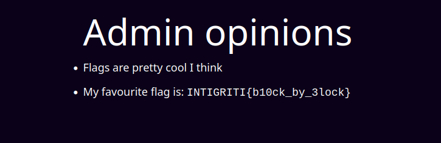

# Share It (part 2)

## Description

I heard some people were able to tamper with the IV, so I removed it from the cookie. I even did some debug testing and discovered that even if the IV could be modified it is not enough to set the admin attribute of the new tokens!

Author: holmesec
https://shareit-again.ctf.intigriti.io || https://shareit-again2.ctf.intigriti.io

## Source code analysis

Challenge web application source code is provided together with the description; main application logic is (again) defined inside the `app.py` file:

```python
from flask import Flask, render_template, request, redirect, url_for, make_response
from Crypto.Cipher import AES
from Crypto.Util.Padding import pad, unpad
import os
import json
import base64
from uuid import uuid4
import time
from waitress import serve

app = Flask(__name__)

key = os.urandom(16)

id_to_iv = {}
last_clear = int(time.time())

FLAG = os.getenv("FLAG")
if not FLAG:
    FLAG = "FLAG{dummy}"


def store_iv(iv):
    # Clear dict once every hour
    global last_clear
    crnt_time = time.time()
    if crnt_time > 1*60*60 + last_clear:
        id_to_iv.clear()
        last_clear = crnt_time
    iv_id = str(uuid4())
    id_to_iv[iv_id] = iv
    return iv_id


def gen_encrypted_cookie(username, first_name, last_name):
    iv = os.urandom(16)
    cipher = AES.new(key, AES.MODE_CBC, iv=iv)
    user_dict = {'username': username, 'first_name': first_name,
                 'last_name': last_name, 'admin': False}
    c = cipher.encrypt(pad(json.dumps(user_dict).encode(), 16))
    iv_id = store_iv(iv)
    return base64.b64encode(json.dumps({'user_dict': base64.b64encode(c).decode(),
                                        'id': iv_id}).encode()).decode()


def decrypt_cookie(cookie, iv=None):
    cookie_dict = json.loads(base64.b64decode(cookie).decode())
    if iv:
        iv = bytes.fromhex(iv)
    else:
        iv_id = cookie_dict['id']
        iv = id_to_iv.get(iv_id)
        if not iv:
            raise Exception(f'IV not found using id: {iv_id}')
    cipher = AES.new(key, AES.MODE_CBC, iv=iv)
    try:
        pt = cipher.decrypt(base64.b64decode(
            cookie_dict['user_dict'].encode()))
    except:
        raise Exception("Decryption error")
    try:
        pt = unpad(pt, 16)
    except:
        raise Exception("Unpad error")
    try:
        user_dict = json.loads(pt)
    except:
        raise Exception(f'Invalid json: {pt}')
    return user_dict


@app.route("/")
def index():
    cookie = request.cookies.get("token")
    if cookie == None:
        return redirect(url_for('register'))
    else:
        try:
            user_dict = decrypt_cookie(cookie, iv=request.args.get("debug_iv"))
        except Exception as e:
            return str(e), 500
        return render_template('index.html', username=user_dict['username'])


@app.route("/register", methods=['GET', 'POST'])
def register():
    if request.method == "GET":
        return render_template("register.html")
    elif request.method == "POST":
        username = request.form["username"]
        print(f'{username=}')
        if username == None or username == "":
            return "username must be set", 400
        first_name = request.form["first_name"]
        if first_name == None or first_name == "":
            return "first_name must be set", 400
        last_name = request.form["last_name"]
        if last_name == None or last_name == "":
            return "last_name must be set", 400
        cookie = gen_encrypted_cookie(username, first_name, last_name)
        res = make_response(redirect(url_for('index')))
        print(cookie)
        res.set_cookie('token', cookie)
        return res


@app.route("/admin-opinions")
def admin():
    cookie = request.cookies.get("token")
    if cookie == None:
        return redirect(url_for('register'))
    else:
        try:
            user_dict = decrypt_cookie(cookie, iv=request.args.get("debug_iv"))
        except Exception as e:
            return str(e), 500
        if not user_dict['admin'] == True:
            return "<p>Only admins are allowed to read these cool opionons</p>", 403
        else:
            return render_template("admin.html", flag=FLAG)


if __name__ == '__main__':
    app.run(debug=True, host='0.0.0.0', port='5000')
```

The application is similar to the previous version, but with some modifications;
in particular, this time the server is no more sending to the client the actual `iv` used to encrypt the `user_dict`, but only its identifier, in order to be later retrieved from the server-side dictionary in which all users ivs are stored, when authorization process is triggered:

```python
id_to_iv = {"id": "iv"}
```

```python
def gen_encrypted_cookie(username, first_name, last_name):
    iv = os.urandom(16)
    cipher = AES.new(key, AES.MODE_CBC, iv=iv)
    user_dict = {'username': username, 'first_name': first_name,
                 'last_name': last_name, 'admin': False}
    c = cipher.encrypt(pad(json.dumps(user_dict).encode(), 16))
    iv_id = store_iv(iv)
    return base64.b64encode(json.dumps({'user_dict': base64.b64encode(c).decode(),
                                        'id': iv_id}).encode()).decode()
```

Moreover, as we can see in the previous function, `user_dict` has this time a more complex structure:

```python
user_dict = {'username': username, 'first_name': first_name,
                 'last_name': last_name, 'admin': False}
```

In particular, the `'admin'` attribute is placed in the end of the dictionary.

On the other hand, the `/admin-opinions` route remains the same: the flag is displayed only if the `admin` attribute is `True`

```python
@app.route("/admin-opinions")
def admin():
    cookie = request.cookies.get("token")
    if cookie == None:
        return redirect(url_for('register'))
    else:
        try:
            user_dict = decrypt_cookie(cookie, iv=request.args.get("debug_iv"))
        except Exception as e:
            return str(e), 500
        if not user_dict['admin'] == True:
            return "<p>Only admins are allowed to read these cool opionons</p>", 403
        else:
            return render_template("admin.html", flag=FLAG)
```

## Exploit(s)

In order to be allowed to access `/admin-opinions` and obtain the flag it is necessary to inject a token with `admin` set to `True`; the vulnerability is again a [cbc-mode bit-flipping attack](https://zhangzeyu2001.medium.com/attacking-cbc-mode-bit-flipping-7e0a1c185511) but this time things are more complicated, since we don't know the `iv` used by the server.

I tried two approach to forge the new token and solve this challenge.

### First Approach

This first attempt did not work but i am still reporting it because, despite this, i think it is an interesting approach to exploit this kind of vulnerability. Moreover, it implicitly leverages an important characteristic that will be crucial for the implementation of the working solution.

What i did was to basically adapt the solution presented in the previous challenge to obtain the same result: in order to achieve this, i had first to correctly craft the `user_dict` token:

```python
import json
import base64
import requests

base_url = "https://shareit-again.ctf.intigriti.io"

# register a new user and get the corresponding token
def register_user(username, first_name, last_name):
    session = requests.Session()

    register_body = {
        "username": username,
        "first_name": first_name,
        "last_name": last_name,
    }
    session.post(base_url + "/register", data=register_body)
    token = session.cookies["token"]

    token = json.loads(base64.b64decode(token).decode())
    print(f"original token: {token}")
    return token

# forge a new token with -> "admin": true
def forge_token(token, user_dict_leak, enc_user_dict):
    new_admin_value = b" tru"
    new_value_index = 92

    for flip in new_admin_value:
        mask = flip ^ user_dict_leak[new_value_index]
        enc_user_dict[new_value_index - 16] = enc_user_dict[new_value_index - 16] ^ mask
        new_value_index += 1

        token["user_dict"] = base64.b64encode(enc_user_dict).decode()
        new_token = {"token": base64.b64encode(json.dumps(token).encode()).decode()}

    get_flag = requests.get(base_url + "/admin-opinions", cookies=new_token)
    print(get_flag.text)

if __name__ == "__main__":
    user_dict = {'username': "AA", 'first_name': "AAAAAAAAAAAAA",
                    'last_name': "!!!!!!!!!!!!!!!!", 'admin': False}

    token = register_user(user_dict["username"], user_dict["first_name"], user_dict["last_name"])

    user_dict_leak = json.dumps(user_dict).encode()

    # show structure of plaintext blocks
    print(user_dict_leak[:16])
    print(user_dict_leak[16:32])
    print(user_dict_leak[32:48])
    print(user_dict_leak[48:64])
    print(user_dict_leak[64:80])
    print(user_dict_leak[80:96])
    print(f"dict byte size: {len(user_dict_leak)}")

    enc_user_dict = bytearray(base64.b64decode(token["user_dict"]))

    forge_token(token, user_dict_leak, enc_user_dict)
```

output:

```python
original token: {'user_dict': 'V34p2/T0t1FLHAHEvbNt7XEMZiBoYU72lveTdD9fChFXyFeMxMEHNJ8P6KQ68KIqNT2c8yF7mnOru2pmw/17YJ9U0HnvcBASb4FWjBNGYuGwrmvnSCy3OEGla/FZAENpZPmrTWcHfc2ngDF2w1yExA==', 'id': '6c0521aa-a963-44ef-9779-39f36fbed0c1'}
b'{"username": "AA'
b'", "first_name":'
b' "AAAAAAAAAAAAA"'
b', "last_name": "'
b'!!!!!!!!!!!!!!!!'
b'", "admin": fals'
dict byte size: 98
Invalid json: b'{"username": "AA", "first_name": "AAAAAAAAAAAAA", "last_name": "\xed\x11a\xd64\xe3\x1fv\x8fY\xf1y\x9b=5\x11", "admin":  true}'
```

As we can see the steps described above were actually executed, in particular the admin value was effectively forced to the new value: however this attack is not successful because when parsing the decrypted string as a dictionary with `json.loads()`, the function is failing and throwing an exception due to the fact that the corrupted plaintext block:

    "\xed\x11a\xd64\xe3\x1fv\x8fY\xf1y\x9b=5\x11"

is still interpreted as a byte sequence, and not as a characters sequence (even if correctly enclosed between apostrophes).

```python
try:
    user_dict = json.loads(pt)
except:
    raise Exception(f'Invalid json: {pt}')
```

By running the same operation locally, the following output is obtained:

```
>>> json.loads(b'{"username": "AA", "first_name": "AAAAAAAAAAAAA", "last_name": "\xed\x11a\xd64\xe3\x1fv\x8fY\xf1y\x9b=5\x11", "admin":  true}')
Traceback (most recent call last):
  File "<stdin>", line 1, in <module>
  File "/usr/lib/python3.11/json/__init__.py", line 341, in loads
    s = s.decode(detect_encoding(s), 'surrogatepass')
        ^^^^^^^^^^^^^^^^^^^^^^^^^^^^^^^^^^^^^^^^^^^^^
UnicodeDecodeError: 'utf-8' codec can't decode byte 0xed in position 64: invalid continuation byte
```

### Second Approach

As we experienced so far, there is no possibility to forge a new token by modifying an intermediate ciphertext block.
If we give a more in depth read to `/admin-opinions` endpoint handling function, we notice the following:

```python
try:
    user_dict = decrypt_cookie(cookie, iv=request.args.get("debug_iv"))
except Exception as e:
    return str(e), 500
```

This implies that, if provided through the GET request arguments, the decryption of `user_dict` is performed using a client-chosen `iv`.

This is important, because if we are able to retrieve the `iv` associated with the particular registered user, we can again modify it in order to flip the original token.

As we experienced in the [previous section](#first-approach), the server is sending back to the client the decrypted `user_dict` if an exception is thrown by the `json.loads()` method, meaning the provided dictionary is <u>**not a valid JSON object**</u>:

```python
try:
    user_dict = json.loads(pt)
except:
    raise Exception(f'Invalid json: {pt}')
```

This is the main vulnerability of the web application because, since we know the expected plain `user_dict` value, we can send to the server the original token and iterate through all the possible `iv` bytes, for each byte of the `iv` itself, until we find that the corresponding byte of the first block of plaintext is correctly decrypted;

the proof of concept is presented with the following pseudocode:

```python
original_token = __base64_token__;

known_user_dict = [{"username": "AA", "first_name": "AAAAAAAAAAAAA", "last_name": "\xed\x11a\xd64\xe3\x1fv\x8fY\xf1y\x9b=5\x11", "admin":  true}];

decrypted_user_dict;

discovered_iv = [\x00 \x00 \x00 \x00 \x00 \x00 \x00 \x00 \x00 \x00 \x00 \x00 \x00 \x00 \x00 \x00];

for iv_position_to_discover = 1...block_size(=16):

    for byte_value = 0...255:

        # iterating through all possible byte values for all the iv indices
        discovered_iv[iv_position_to_discover] = byte_value;

        decrypted_user_dict = send_to_server(discovered_iv, original_token);

        # check if the byte set for that given iv index correctly decrypted the corresponding user_dict value at the same index position (i.e. xor was computed using the correct values)
        if decrypted_user_dict[iv_position_to_discover] == known_user_dict[iv_position_to_discover]:
            # found the correct byte value for the iv at index "iv_position_to_discover"
            discovered_iv[iv_position_to_discover] = byte_value;
            # go to next iv byte discovery
            break

```

What reported above is feasible because until we don't know the whole server `iv`, we will always decrypt:

- an invalid JSON object containing random bytes
- a valid JSON object but containing different values with respect to the expected known `user_dict`.

However, we must take care of the limit case in which we are trying to discover the last bytes of the `iv`, because even if the wrong byte is set for that specific `iv` element, we will indeed decrypt some valid characters at some point and if the whole `user_dict` will then result in a valid JSON object we won't receive the exception message displaying the decrypted data:

we can easily avoid this pitfall by setting the `iv` byte which is XORed with the `":"` character (after it is discovered), which is separating the key from the corresponding value, with another random byte in order to force the decryption to always result in an invalid JSON object.

After the original server `iv` is obtained, we can again modify it in order to set the `admin` value to `True`;

At this point what is left is the crafting of the new `user_dict` value; there are some important aspects to consider at this point:

1. We can perform `bit-flipping` only on the first block:
   - we cannot inject the new value into the original `admin` attribute because this is placed (at least) in the third block.
2. due to `user_dict` structure, even if we correctly set the first plaintext block to contain the `"admin":true` string, we still have the original `"admin":false` value in one of the following blocks that will overwrite our injected value when the casting into a dictionary is done:

   ```python
   >>> json.loads(b'{"admin":true, "first_name": "AAAAAAAAAAAAA", "last_name": "!!!!!!!!!!!!!!!!", "admin": false}')
    {'admin': False, 'first_name': 'AAAAAAAAAAAAA', 'last_name': '!!!!!!!!!!!!!!!!'}
   ```

Since the only `user_dict` attribute to be checked is `admin` (no integrity check on the whole `user_dict` structure i.e. valid `username`, `first_name` and `last_name`) we can send back to the server just the first ciphertext block and force its decryption to the following value:

```python
new_token_value = b'{"admin":true}\x02\x02'
```

which is a valid block on which the default padding schema applied by `Crypto.Util.Padding.pad()` is inserted (`PKCS#7`): adding the last two bytes of padding is necessary because during the `user_dict` decryption process the `Crypto.Util.Padding.unpad()` method is invoked, and so a valid padding is expected to be present into the recovered dictionary.

To sum up, we need to modify the server `iv` in order to force the above value to be decrypted, and send back to the server the token containing:

- the first block of the original `user_dict` ciphertext
- the modified `iv`

All the steps deeply described until now are implemented in the following script:

```python
import codecs
import json
import base64
import requests
import re

base_url = "https://shareit-again.ctf.intigriti.io"

# register a new user and get the corresponding token
def register_user(username, first_name, last_name):
    session = requests.Session()

    register_body = {
        "username": username,
        "first_name": first_name,
        "last_name": last_name,
    }
    register = session.post(base_url + "/register", data=register_body)
    token = session.cookies["token"]

    token = json.loads(base64.b64decode(token).decode())
    print(f"original token: {token}")
    return token

# discover the iv used by the server by analyzing the exception message
def iv_oracle(user_dict_leak, token, iv_length=16):
    debug_iv = {"debug_iv": None}

    # discover iv
    iv = bytearray(b"\x00" * iv_length)
    index_to_discover = 0
    invalid_known_value = 0
    invalid_known_value_index = 0

    while index_to_discover < iv_length:
        for iv_value in range(256):
            iv[index_to_discover] = iv_value

            new_token = {"token": base64.b64encode(json.dumps(token).encode()).decode()}
            debug_iv = {"debug_iv": iv.hex()}

            get_flag = requests.get(
                base_url + "/admin-opinions", cookies=new_token, params=debug_iv
            )
            print(get_flag.text)

            if "Invalid json" in get_flag.text:
                retrieved_token = re.search("b'(.*)'", get_flag.text)[0]
                start_index = retrieved_token.find("b'") + 2
                end_index = retrieved_token.find(",", start_index)
                retrieved_token = retrieved_token[start_index:end_index]
                retrieved_token = retrieved_token[:-1]
                retrieved_token = codecs.decode(retrieved_token, "unicode_escape")

                retrieved_token = retrieved_token.encode("latin-1")

                if (
                    len(retrieved_token) > index_to_discover
                    and retrieved_token[index_to_discover]
                    == user_dict_leak[index_to_discover]
                ):
                    print("found a valid iv byte")
                    if retrieved_token[index_to_discover] == ord(b":"):
                        invalid_known_value = iv_value - 1
                        iv[index_to_discover] = invalid_known_value
                        invalid_known_value_index = index_to_discover
                    index_to_discover += 1
                    break

    iv[invalid_known_value_index] = invalid_known_value + 1
    print(f"Server iv found: {iv}")
    return iv

def forge_token(token, user_dict_leak, first_block, server_iv):
    # token to forge and to be decrypted server-side
    new_token_value = b'{"admin":true}\x02\x02'
    index_to_flip = 0
    flipped_iv = bytearray(server_iv)

    for flip in new_token_value:
        mask = flip ^ user_dict_leak[index_to_flip]
        flipped_iv[index_to_flip] = flipped_iv[index_to_flip] ^ mask
        index_to_flip += 1

    token["user_dict"] = base64.b64encode(first_block).decode()

    new_token = {"token": base64.b64encode(json.dumps(token).encode()).decode()}
    debug_iv = {"debug_iv": flipped_iv.hex()}

    get_flag = requests.get(
        base_url + "/admin-opinions", cookies=new_token, params=debug_iv
    )
    if "flag" in get_flag.text:
        print(f"forged token: {new_token}")
        print(f"forged iv: {flipped_iv.hex()}")
        print(get_flag.text)

if __name__ == "__main__":
    user_dict = {
        "username": "ME",
        "first_name": "ADMIN_SOOOOON",
        "last_name": "NOT_YET_ADMIN???",
        "admin": False,
    }

    user_dict_leak = json.dumps(user_dict).encode()
    token = register_user(user_dict["username"], user_dict["first_name"], user_dict["last_name"])
    enc_user_dict = bytearray(base64.b64decode(token["user_dict"]))
    server_iv = iv_oracle(user_dict_leak, token, iv_length=16)
    forge_token(token, user_dict_leak, enc_user_dict[:16], server_iv)
```

output:

```python
Invalid json: b'}0&\x82\xd7\xb8<\x81W\xfe$Yg\xd06\x08", "first_name": "ADMIN_SOOOOON", "last_name": "NOT_YET_ADMIN???", "admin": false}'
Invalid json: b'|0&\x82\xd7\xb8<\x81W\xfe$Yg\xd06\x08", "first_name": "ADMIN_SOOOOON", "last_name": "NOT_YET_ADMIN???", "admin": false}'
Invalid json: b'\x7f0&\x82\xd7\xb8<\x81W\xfe$Yg\xd06\x08", "first_name": "ADMIN_SOOOOON", "last_name": "NOT_YET_ADMIN???", "admin": false}'
Invalid json: b'~0&\x82\xd7\xb8<\x81W\xfe$Yg\xd06\x08", "first_name": "ADMIN_SOOOOON", "last_name": "NOT_YET_ADMIN???", "admin": false}'
Invalid json: b'y0&\x82\xd7\xb8<\x81W\xfe$Yg\xd06\x08", "first_name": "ADMIN_SOOOOON", "last_name": "NOT_YET_ADMIN???", "admin": false}'
Invalid json: b'x0&\x82\xd7\xb8<\x81W\xfe$Yg\xd06\x08", "first_name": "ADMIN_SOOOOON", "last_name": "NOT_YET_ADMIN???", "admin": false}'
Invalid json: b'{0&\x82\xd7\xb8<\x81W\xfe$Yg\xd06\x08", "first_name": "ADMIN_SOOOOON", "last_name": "NOT_YET_ADMIN???", "admin": false}'
found a valid iv byte
Invalid json: b'{0&\x82\xd7\xb8<\x81W\xfe$Yg\xd06\x08", "first_name": "ADMIN_SOOOOON", "last_name": "NOT_YET_ADMIN???", "admin": false}'
Invalid json: b'{1&\x82\xd7\xb8<\x81W\xfe$Yg\xd06\x08", "first_name": "ADMIN_SOOOOON", "last_name": "NOT_YET_ADMIN???", "admin": false}'
...
...
...
Invalid json: b'{"username"; "$\x08", "first_name": "ADMIN_SOOOOON", "last_name": "NOT_YET_ADMIN???", "admin": false}'
Invalid json: b'{"username"; "%\x08", "first_name": "ADMIN_SOOOOON", "last_name": "NOT_YET_ADMIN???", "admin": false}'
Invalid json: b'{"username"; ""\x08", "first_name": "ADMIN_SOOOOON", "last_name": "NOT_YET_ADMIN???", "admin": false}'
Invalid json: b'{"username"; "#\x08", "first_name": "ADMIN_SOOOOON", "last_name": "NOT_YET_ADMIN???", "admin": false}'
...
...
...
Invalid json: b'{"username"; "MC", "first_name": "ADMIN_SOOOOON", "last_name": "NOT_YET_ADMIN???", "admin": false}'
Invalid json: b'{"username"; "MD", "first_name": "ADMIN_SOOOOON", "last_name": "NOT_YET_ADMIN???", "admin": false}'
Invalid json: b'{"username"; "ME", "first_name": "ADMIN_SOOOOON", "last_name": "NOT_YET_ADMIN???", "admin": false}'
found a valid iv byte
Server iv found: bytearray(b'&\x12S\xf1\xb2\xcaR\xe0:\x9b\x06cG\xf2{M')
forged token: {'token': 'eyJ1c2VyX2RpY3QiOiAiUUlJaHRQQVZWSTFLcHpmcVlyaDZVQT09IiwgImlkIjogImU0MDMxMGRjLTRkOTEtNGJiNS05NDhiLTRiM2UxNDg4OGE1NSJ9'}
forged iv: 261247e6bad152a36d8a562c02ad340a
<!DOCTYPE html>
<html lang="en">
  <head>
    <meta charset="UTF-8" />
    <meta http-equiv="X-UA-Compatible" content="IE=edge" />
    <meta name="viewport" content="width=device-width, initial-scale=1.0" />
    <link rel="stylesheet" href="/static/style.css" />
    <title>Admin - ShareIt</title>
  </head>
  <body class="bg-primary">
    <div class="container mx-auto max-w-3xl p-6 text-white">

<div class="max-w-max mx-auto">
  <h1 class="text-6xl mb-4 text-center">Admin opinions</h1>
  <ul class="list-disc">
    <li class="text-lg mb-3">Flags are pretty cool I think</li>
    <li class="text-lg mb-3">My favourite flag is: <code>INTIGRITI{b10ck_by_3lock}</code></li>
  </ul>
</div>

    </div>
  </body>
</html>
```

rendered page:



flag:

    INTIGRITI{b10ck_by_3lock}
