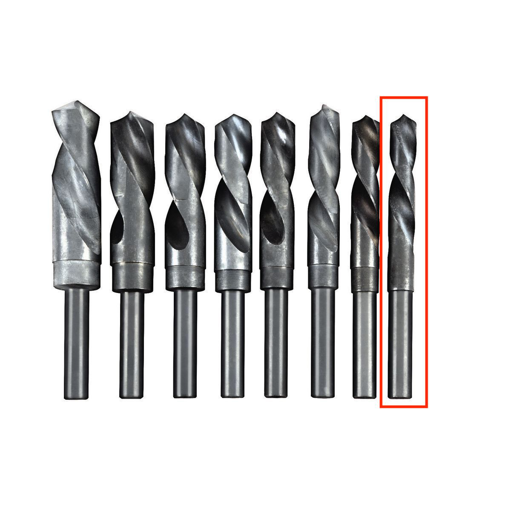

# BigJPG

The challenge provides the following file named `big-image.jpg`:


I somehow decided to try extracting data from the image:

```bash
binwalk -Me big-image.jpg
```

Unexpectedly, i found a compressed archive which contained the following files: 

`flag.jpg`


`key.png`



The names are quite exhaustive, i expected to find a key inside the `key.png` in order to obtain the actual flag from the `flag.jpg` file.

At this point i tried all common steganography practices until i decided to give a look at the LSB bits of `key.png`.

I used [Stegsolve](https://wiki.bi0s.in/steganography/stegsolve/) to do this and obtained the following piece of data:

    [password: uR_aLmOsT_tHeRe]

I tried to use this password to extract hidden data inside `flag.jpg`:

```bash
steghide extract -sf flag.jpg -p uR_aLmOsT_tHeRe 
wrote extracted data to "flag.txt".
```

which contained the flag:

    UDCTF{lay3r5_0n_lay3r5}


