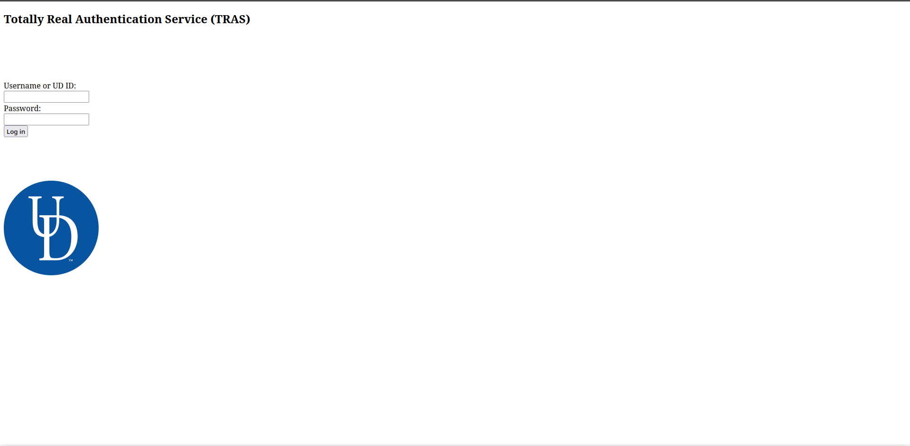

# SQL 4 Dummies

The challenge provides the following description and url:

    Break into ole Professor James' school account. I think his username is rickjames. 

https://bluehens-sql-for-dummies-service.chals.io/

It just shows the following html login interface:

Since it should be a very trivial SQL injection i tried to perform login using the [most common payloads](https://github.com/payloadbox/sql-injection-payload-list) and in the end i succeeded in defining the correct one:

    username=rickjames' AND 1=1--
    password=something_random_because_the_form_complains_for_empty_value

and i obtained the flag:

    UDCTF{wh4ts_my_n4m3_4g4in?} 

