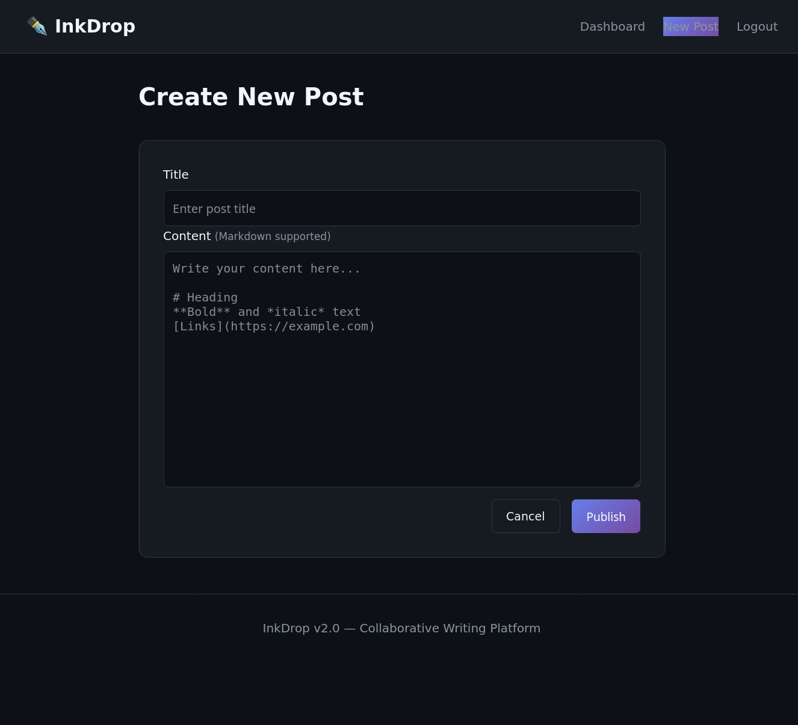

# Intigriti's February challenge 0226 by [d3dn0v4](https://x.com/d3dn0v4)

## Description 

The solution:

* Should leverage a XSS vulnerability on the challenge page.
* Shouldn't be self-XSS or related to MiTM attacks.
* Should work in the latest version of Google Chrome.
* Should include:
    * The flag in the format **INTIGRITI{.*}**
    * The payload(s) used
    * Steps to solve (short description / bullet points)
* Should be reported on the Intigriti platform.

Get started:

1. Download the [challenge source code](https://challenge-0226.intigriti.io/static/source.zip)
2. Solve it locally!
3. Repeat your attack against the [challenge page](https://challenge-0226.intigriti.io/challenge) & let's capture that flag!


## Analysis

The target is a web application that allows users to freely publish their favourite ~~XSS payloads~~, profound literary reflections and thoughts on the misery of the human condition ✒️🪶🖋️.


Seized by a sudden artistic impulse, I decide that I too want to be part of it all and sign up so that I can give free rein to my creativity.



But before diving headfirst into writing, I thought it might be very useful to read the source a little and see if it could help me focus my writing on something *appropriately expressive*.

The backend is written in Flask and exposes several interesting endpoints, including:

```python
@app.route('/post/new', methods=['GET', 'POST'])
@login_required
def post_new():
    if request.method == 'POST':
        title = request.form.get('title', '').strip()
        content = request.form.get('content', '').strip()
        
        if not title or not content:
            flash('Title and content required.', 'error')
            return render_template('post_new.html')
        
        post = Post(
            title=title,
            content=content,
            author_id=session['user_id']
        )
        db.session.add(post)
        db.session.commit()
        
        flash('Post created!', 'success')
        return redirect(url_for('post_view', post_id=post.id))
```
Newly created posts are not properly sanitised; user-supplied content is stored without any security filtering.

```python
@app.route('/api/render')
def api_render():
    post_id = request.args.get('id')
    if not post_id:
        return jsonify({'error': 'Missing id'}), 400
    
    post = Post.query.get(post_id)
    if not post:
        return jsonify({'error': 'Not found'}), 404
    
    rendered_html = render_markdown(post.content)
    
    return jsonify({
        'id': post.id,
        'title': post.title,
        'html': rendered_html,
        'author': post.author.username,
        'rendered_at': time.time()
    })
    ...
    def render_markdown(content):
    html_content = content
    html_content = re.sub(r'^### (.+)$', r'<h3>\1</h3>', html_content, flags=re.MULTILINE)
    html_content = re.sub(r'^## (.+)$', r'<h2>\1</h2>', html_content, flags=re.MULTILINE)
    html_content = re.sub(r'^# (.+)$', r'<h1>\1</h1>', html_content, flags=re.MULTILINE)
    html_content = re.sub(r'\*\*(.+?)\*\*', r'<strong>\1</strong>', html_content)
    html_content = re.sub(r'\*(.+?)\*', r'<em>\1</em>', html_content)
    html_content = re.sub(r'\[(.+?)\]\((.+?)\)', r'<a href="\2">\1</a>', html_content)
    html_content = html_content.replace('\n\n', '</p><p>')
    html_content = f'<p>{html_content}</p>'
    return html_content
```

The application renders user-supplied Markdown content without performing any form of HTML sanitisation or output encoding, allowing arbitrary HTML and JavaScript to be stored and potentially executed in the browser.

Another very interesting element is the following endpoint:

```python
@app.route('/api/jsonp')
def api_jsonp():
    callback = request.args.get('callback', 'handleData')
    
    if '<' in callback or '>' in callback:
        callback = 'handleData'
    
    user_data = {
        'authenticated': 'user_id' in session,
        'timestamp': time.time()
    }
    
    if 'user_id' in session:
        user = User.query.get(session['user_id'])
        if user:
            user_data['username'] = user.username
    
    response = f"{callback}({json.dumps(user_data)})"
    return Response(response, mimetype='application/javascript')
```

**JSONP (JSON with Padding)** is a legacy technique used to overcome browser **Same-Origin Policy (SOP)** restrictions for cross-origin requests before **Cross-Origin Resource Sharing (CORS)** existed.

Browsers normally block **fetch** or **XMLHttpRequest** calls from one domain to another (cross-origin) for security.

`<script>` tags, however, are not restricted by SOP: they can load scripts from any domain.

JSONP works by returning executable JavaScript rather than raw JSON; the client provides the callback function name as a query parameter, and the server reflects this value directly into the response, wrapping the JSON payload inside a dynamically generated function call.

```javascript
fetch('/api/render?id=' + postId)
        .then(function(response) {
            if (!response.ok) throw new Error('Failed to load');
            return response.json();
        })
        .then(function(data) {
            const preview = document.getElementById('preview');
            preview.innerHTML = data.html;
            processContent(preview);
        })
        .catch(function(error) {
            document.getElementById('preview').innerHTML = '<p class="error">Failed to load content.</p>';
        });
    
    function processContent(container) {
        const codeBlocks = container.querySelectorAll('pre code');
        codeBlocks.forEach(function(block) {
            block.classList.add('highlighted');
        });
        
        const scripts = container.querySelectorAll('script');
        scripts.forEach(function(script) {
            if (script.src && script.src.includes('/api/')) {
                const newScript = document.createElement('script');
                newScript.src = script.src;
                document.body.appendChild(newScript);
            }
        });
    }
```

The application fetches user-submitted post content from `/api/render` on the client-side and inserts it directly into the **DOM** using `innerHTML`. 
It then processes code blocks for highlighting and reinjects any `<script src="/api/...">` tags. 

## Exploit

Because the content is not sanitized or escaped, this creates a Stored DOM-based Cross-Site Scripting (XSS) vulnerability, allowing arbitrary JavaScript from user posts to execute in other users’ browsers.


