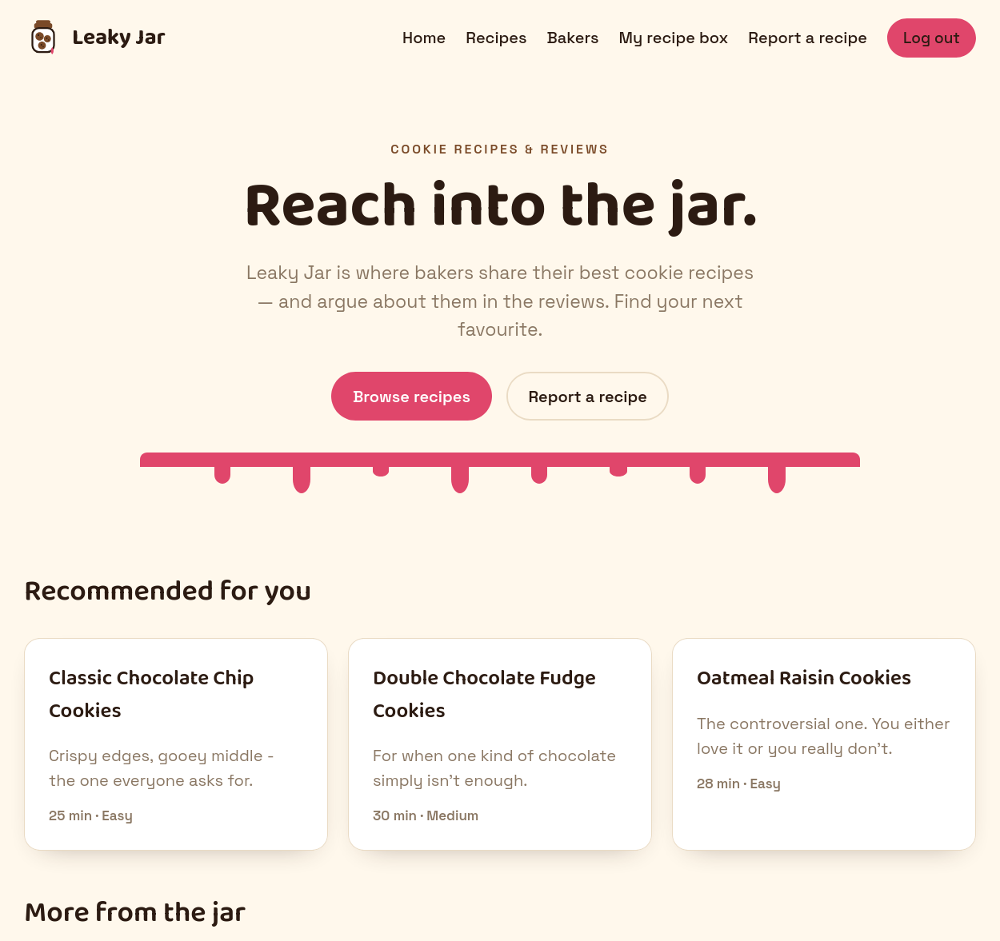
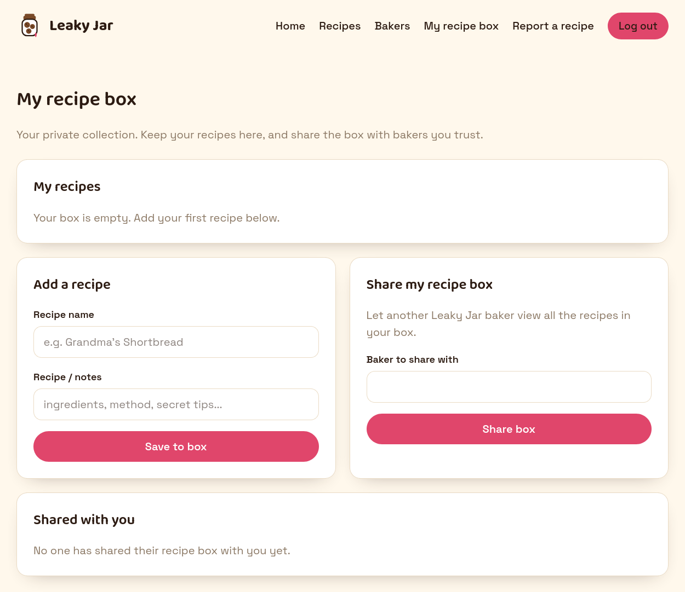
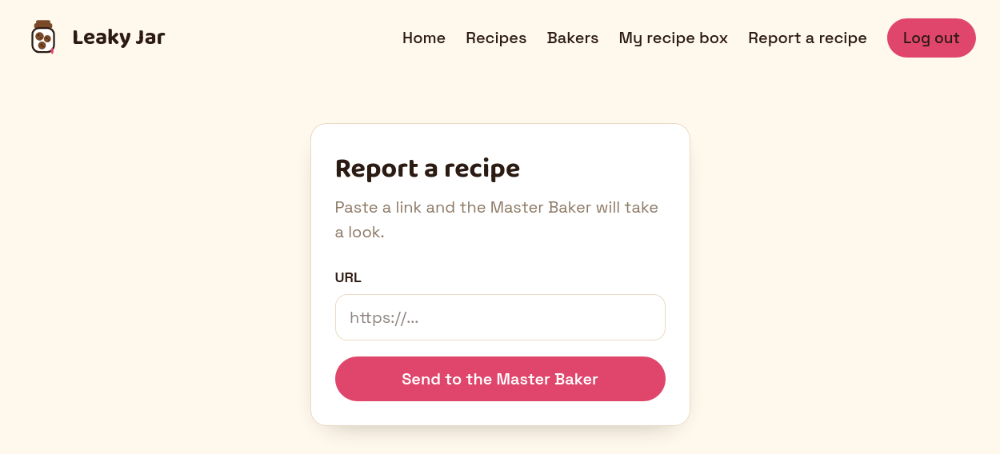
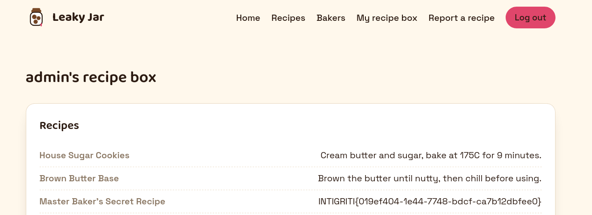

# Intigriti's June bonus challenge by [ProxyNomadd](https://x.com/ProxyNomadd)

## Description 

The solution:

* Should leverage a **XSS** vulnerability on the challenge page.
* Shouldn't be **self-XSS** or related to **MiTM** attacks.
* Should work in the latest version of Google Chrome.
* Should not require more than 1 click from the victim (includes).
* Should include:
    * The flag in the format **INTIGRITI{.*}**
    * The payload(s) used
    * Steps to solve (short description / bullet points)
* Should be reported on the Intigriti platform.

Get started:

1. Test your payloads on the [challenge page](https://leakyjar.intigriti.io/challenge) & let's capture that flag!

## TL;DR

1. The application has a **CSRF** vulnerability in the `/share` endpoint, allowing an attacker to trick a victim into sharing their recipe box with an attacker-controlled account.
2. The application allows users to report arbitrary URLs to the Master Baker, whose browser automatically visits the reported URLs.
3. By hosting a malicious page containing a **CSRF** payload and reporting its URL to the Master Baker, an attacker can trick the administrator into sharing their recipe box with the attacker's account, allowing the attacker to retrieve the flag.

## Analysis

The target is a web application named **"Leaky Jar"** where users can freely share and comment on cookies recipes. 
Let's take a closer look and find out whether cookies are the only things being cooked 👨‍🍳🍪.



After creating an account and logging in, we can see that each user has a personal recipe box where they can store their own recipes and share the entire box with other users.



Moreover, users can report arbitrary URLs to the Master Baker `(username=admin)`, whose profile can be found on the `/bakers` page.



## Exploit 

The first hypothesis was that the application might be vulnerable to **Cross-Site Scripting (XSS)**. However, testing the available input fields quickly showed that all HTML tags were properly escaped, ruling out straightforward XSS injection.

The next step was to inspect the application's requests and responses in search of misplaced or missing security controls.

The first observation was that the report URL functionality performed no input validation: there were no same-origin or domain restrictions, allowing users to submit arbitrary URLs to the Master Baker. 
By monitoring requests to an external server (e.g., a request bin), it was also confirmed that every reported URL was automatically visited by the administrator's browser.

Going further, the `/share` request looked like a potential candidate for exploitation. This request allowed users to share their recipe box with other users by sending a POST request to the `/share` endpoint with the target user's username in the request body. 
The request looked like this:

```http
POST /share HTTP/2
Host: leakyjar.intigriti.io
Cookie: session=<session_jwt>
Content-Length: 14
Origin: https://leakyjar.intigriti.io
Content-Type: application/x-www-form-urlencoded
...

username=admin
```

As shown above, the request does not implement any **Cross-Site Request Forgery (CSRF)** protection. As a result, an attacker can trick a victim into issuing the request on their behalf, causing the victim to unknowingly share their recipe box with an attacker-controlled account.

As an additional confirmation, the request can be replayed multiple times and is always processed successfully, indicating the absence of any anti-CSRF mechanism.

To validate the hypothesis, the following **CSRF** proof of concept was created. The page automatically submits a request to share the current user's recipe box with the attacker's account.

```html
<form id="myForm" action="https://leakyjar.intigriti.io/share" method="POST">
    <input type="hidden" name="username" value="test_user">
</form>
<script>
        document.forms[0].submit();
</script>
```

After loading the page while authenticated, the form is automatically submitted and the recipe box is successfully shared with the attacker's account, confirming the presence of the **CSRF** vulnerability.

At this point, the two identified issues can be combined into a complete attack chain. 
Since the application allows arbitrary URLs to be reported to the Master Baker, and those URLs are automatically visited by the administrator, an attacker can host the malicious page shown above and submit its URL through the reporting feature. 
When the admin visits the page, the embedded **CSRF** payload executes in the context of the admin's authenticated session, tricking the admin into sharing their recipe box with the attacker's account.

Assuming the flag is stored in the Master Baker's private recipe box, the attacker can then access the shared box and retrieve the flag.

The approach I used to host the malicious page on a local container and expose it to the internet was to use [bore](https://github.com/ekzhang/bore). 
This tool is particularly useful in this scenario, as alternatives such as [ngrok](https://ngrok.com/) or [localtunnel](https://github.com/localtunnel/localtunnel) may introduce interstitial warning pages that require user interaction before proceeding, which would prevent fully automated exploitation in this type of challenge.

```bash
# inside container (hosting malicious page)
echo '<form id="myForm" action="https://leakyjar.intigriti.io/share" method="POST">
    <input type="hidden" name="username" value="test_user">
</form>
<script>
    document.forms[0].submit();
</script>' > index.html

python3 -m http.server 80

# expose service to the internet
bore local 8000 --to bore.pub  # generates public URL (e.g., https://bore.pub:xxxx)
```

The generated URL was submitted to the **“report URL”** functionality, allowing the administrator bot to access the hosted page and trigger the exploit chain.
The final result was that the Master Baker's recipe box was successfully shared with the attacker's account, allowing the attacker to retrieve the flag as shown in the screenshot below.



