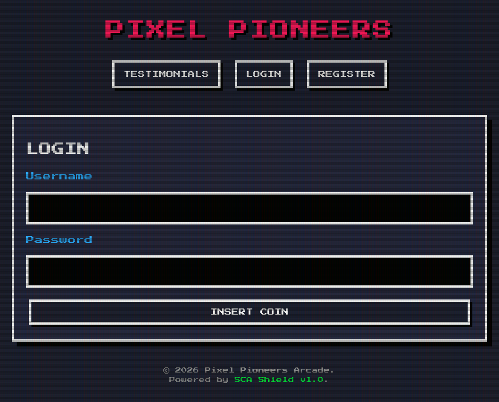
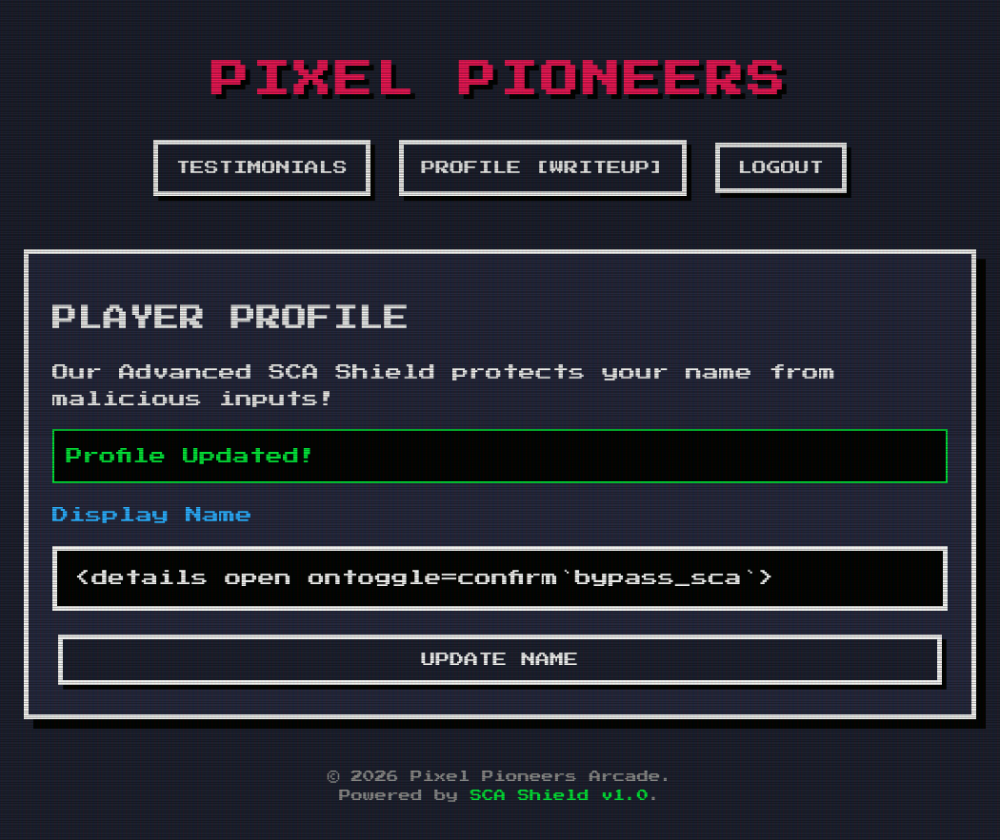

# Intigriti's March challenge 0526 by [KulinduKodi](https://x.com/KulinduKodi) - unintended Solution


## Description 

The solution:

* Should leverage a **XSS** vulnerability on the challenge page.
* Shouldn't be **self-XSS** or related to **MiTM** attacks.
* Should not require more than 1 click from the victim (includes).
* Should include:
    * The payload(s) used
    * Steps to solve (short description / bullet points)
* Should be reported on the Intigriti platform.

Get started:

1. Test your payloads on the [challenge page](hhttps://challenge-0526.intigriti.io/challenge) & let's pop that alert!

## TL;DR

The `/testimonials` endpoint is vulnerable to **stored DOM XSS** through unsanitized username rendering.

- `nameDiv.innerHTML = t.user_name` is the vulnerable sink
  - `t.user_name` flows from `/api/profile` → `/api/testimonials` without sanitization
- **Server-side** validation blocks **common XSS patterns, dots, commas, semicolons, parentheses, and quotes**
  - Tagged template syntax (`` `arg` ``) calls functions without parentheses — not blocked
- Payload `` <details open ontoggle=confirm`bypass_sca`> `` bypasses validation and is stored successfully
  - The `open` attribute fires `ontoggle` on render — no user interaction required (unintended solution)
  - Executes for all page visitors

## Analysis

The target application is a retro arcade-themed Single Page Application (SPA) built with vanilla JavaScript.  


*NBA JAM for those interested (10/10 fun)*

The website provides:

- user **registration/login**
- **editable player profiles** **(!)**
- community **testimonials** **(!)**
- client-side **routing** using hash fragments
- dynamic **DOM** rendering



The application heavily relies on JavaScript to render content dynamically inside the page using `innerHTML`.

The main interesting functionality is the `/testimonials` page, where user testimonials and profile display names are rendered for all visitors.

The application uses SPA routing and dynamically updates the page content through JavaScript.

The most relevant part is inside `loadTestimonials()`:

```javascript
async function loadTestimonials() {
    let res = await fetch('/api/testimonials');
    let data = await res.json();

    data.forEach(t => {
        let card = document.createElement('div');

        let nameDiv = document.createElement('div');
        nameDiv.className = 'user-name';

        // Vulnerable sink
        nameDiv.innerHTML = t.user_name;

        let textDiv = document.createElement('div');
        textDiv.className = 'user-text';

        // Properly sanitized
        textDiv.innerHTML = DOMPurify.sanitize(t.content);

        card.appendChild(nameDiv);
        card.appendChild(textDiv);
    });
} 
```

The vulnerability comes from:

```javascript
nameDiv.innerHTML = t.user_name;
```

because `t.user_name` is fully attacker-controlled.

The actual display name value originates from the profile update endpoint:

```javascript
fetch('/api/profile', {
    method: 'POST',
    headers: {'Content-Type': 'application/json'},
    body: JSON.stringify({name})
});
```

and is later retrieved through:

```javascript
fetch('/api/testimonials');
```

The important observation is that:

1. testimonial content is sanitized with DOMPurify
2. usernames are inserted directly with innerHTML
3. no sanitization is applied to t.user_name

This creates a **Stored DOM XSS** vulnerability.

## Exploit

The vulnerability is clear, but things are not quite as simple as I have described them so far.

In fact, the application includes a custom blacklist-based validation mechanism referred to as **"SCA Shield"** that is applied to the profile update endpoint.

The filter blocks many common **XSS** patterns, including:
* **quotes** - ' "
* **parentheses** - ()
* **semicolons** - ;
* **commas** - ,
* **dots** - .
* **common XSS payloads**: (`<script>`, `onerror=`, `onload=`, etc.)

These together prevent classic **XSS** payloads from working, such as:

```html
<script>alert(1)</script> 
 
<svg onload=alert(1)>
...
```

However, the filter is not perfect and can be bypassed 🔑.

**Tagged templates** are not blocked by the filter, and they can be used to craft a payload free of any blacklisted character.

In JavaScript, a **tagged template literal** allows a function to be called using backtick syntax rather than parentheses — the function receives the static string parts and interpolated values as separate arguments:

```javascript
function log(strings, value) {
  console.log(strings, value);
}

const user = "Alice";
log`Hello ${user}!`;
// → log(["Hello ", "!"], "Alice")
```

This means `` fn`arg` `` and `` fn(arg) `` are functionally equivalent.
The filter blocks `(` and `)`, but not backticks, so `` confirm`bypass_sca` `` passes validation and still executes.

```javascript
confirm("bypass_sca")  // blocked — contains parentheses
confirm`bypass_sca`    // not blocked — backtick call syntax
```

In our case, this lets us craft a payload containing none of the blacklisted characters:

```html
<details open ontoggle=confirm`bypass_sca`>
```

`<details>` is a native HTML element that fires `ontoggle` whenever it opens or closes. The `open` attribute renders it expanded by default, so `ontoggle` triggers immediately on render — no click required. Since `confirm`, `open`, `ontoggle`, and backticks are all absent from the blacklist, the payload passes validation and is stored successfully.



As soon as any visitor loads `/testimonials`, the injected username hits the DOM and the payload executes — no interaction needed. This is the unintended part: the intended solution required one click to toggle the `<details>` element, but `open` makes that unnecessary.


