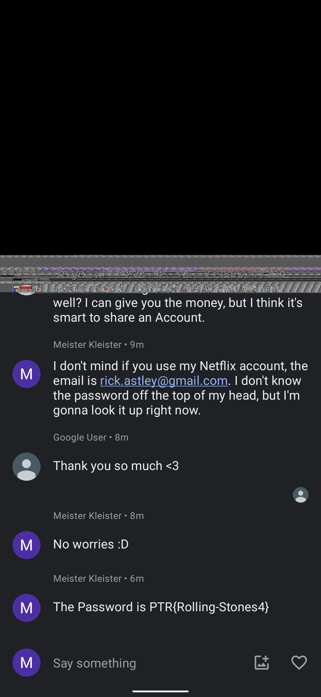

# qc02-missingChat

The file provided (```Screenshot_20230808-pixel6pro.png```) contains the following:


The file name suggests we are dealing with a screenshot...but why also the device name is specified?

Here you have the [answer](https://www.androidauthority.com/pixel-markup-screenshots-vulnerability-3299986/). 

Using [Acropalypse](https://acropalypse.app/) tool allows to obtain again the original image:



which contains the flag **```PTR{Rolling-Stones4}```**